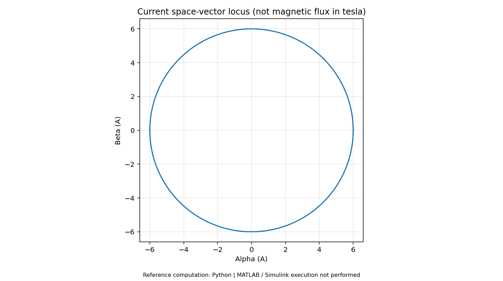

# 第01册｜电机原理 · 参数与选型

> 《电机控制：原理、案例与MATLAB实验》 · 版本1.0 · 2026-09-27  
> 原题范围：Q001, Q002, Q003, Q004, Q005, Q006, Q007, Q008, Q009, Q010, Q011, Q012, Q013, Q014, Q015, Q016  
> 本册对应实验：[L01 三相电流与旋转空间矢量](14_MATLAB实验逐步手册.md#lab01)；[L02 RL电气时间常数与机械惯性](14_MATLAB实验逐步手册.md#lab02)；[L24 开关损耗与一阶热模型](14_MATLAB实验逐步手册.md#lab24)

[返回总览](00_学习总览与环境指南.md) · [200题索引](99_200题分册与实验索引.md) · [实验手册](14_MATLAB实验逐步手册.md) · [验证边界](16_验证记录与已知边界.md)

**阅读方式：**先读下面连贯教程，再看原题逐项讲解与新增案例，最后按实验手册运行和改参数。正文所有数值模型为教学设定，不是你的电机实测参数。原题答案完整保留其主体内容，并补充新的案例与验证任务；不是只按标题切割原文件。

**执行边界：**本包的47张结果图来自独立Python参考实现。MATLAB主实验源码共24项，未在交付环境原生执行；扩展任务、PLL/HFI和动态弱磁等未完成项均明确标注。基础MATLAB实验不要求专业控制工具箱，Simulink入门模型另需Simulink。

## 一、先建立“电—磁—机械—热”的完整认识

对电机最容易形成的误解，是把它当作“输入一个 PWM，占空比决定转速”的黑箱。对实际闭环来说，PWM 先改变平均电压，电压通过绕组电阻、电感与反电动势决定电流，电流与磁链共同决定转矩，净转矩再改变转速。温度则慢慢改变参数和允许工作范围。

```text
母线电压 → 逆变器平均相电压 → 绕组电流 → 电磁转矩 → 角加速度 → 转速 → 位置
                 ↑               │                           │
                 └───── 反电动势与电压约束 ←──────────────────┘
                                 └→ 损耗 → 温度 → 电阻/限流
```

这张因果链可以用来判断某个实验有没有把关键物理反馈闭合。L02 的 RL 阶跃只研究“电压→电流”，其中机械响应由RL电流经Kt转换成转矩单向驱动，机械速度不会反向影响电流；L11 才把反电动势、转矩和机械运动连接起来。**不要用 L02 的恒定电压 RL 最终电流，预测一台已经高速转动的真实电机。**[S17]

### 1.1 三相电流为什么形成旋转矢量

令三相绕组磁轴分别位于 $0,120^\circ,240^\circ$ 电角度，通入：

$$i_a=I\cos\theta,\quad i_b=I\cos(\theta-2\pi/3),\quad i_c=I\cos(\theta+2\pi/3).$$

将每一相电流乘以对应方向的单位矢量再相加，基波结果为：

$$\boldsymbol F\propto \frac32 I[\cos\theta,\sin\theta]^T.$$

其中 $3/2$ 来自三相空间投影。Clarke 的 $2/3$ 缩放把电流空间矢量幅值归一到相电流峰值 $I$。L01 画出的圆是 **电流坐标的轨迹，单位 A**，不是已经计算出磁感应强度 T；要得到真实磁场还需要匝数、气隙、磁路和饱和等信息。

运行 `run_lab(1)`，先看三条相电流，再看 αβ 平面。把频率由 50 Hz 改成 100 Hz：同样观察时长内转过更多圈，圆半径不应改变。把振幅由 6 A 改成 3 A：圆半径减半，频率不应改变。然后只把 B 相幅值减小 10%，观察圆变形和三相和残差；这是对称性被破坏，而不是“坐标变换算法坏了”。

## 二、从微分方程理解时间常数

锁定转子并忽略耦合时：

$$L\dot i+Ri=U,\qquad i(t)=\frac UR(1-e^{-t/\tau}),\quad \tau=L/R.$$

本课程取 $R=0.2\Omega,L=0.4mH,U=2V$，所以 $\tau=2ms$、最终电流 10 A。经过一个时间常数达到约 63.2%，三个时间常数约 95.0%。时间常数描述响应快慢，最终值则由电压和电阻决定，两者不能混在一起。

L02 采用精确零阶保持离散模型：

$$i[k+1]=a i[k]+b u[k],\quad a=e^{-RT_s/L},\quad b=(1-a)/R.$$

它表示一个采样周期内电压保持恒定时的准确 RL 更新。与之对照，前向欧拉 $i[k+1]=(1-RT_s/L)i[k]+T_su[k]/L$ 在步长太大时可能数值发散，甚至把物理上稳定的 RL 电路算成振荡。先检查步长，再怀疑物理规律。

## 三、转矩、功率、电流与热，分别限制什么

本教程 SPMSM 的峰值 q 电流转矩系数：

$$K_t=\tfrac32p\psi_f=\tfrac32\times4\times0.02=0.12\;Nm/A.$$

8 A 的 q 电流对应 0.96 N·m 电磁转矩。若转速为 100 rad/s，电磁转换功率为 96 W；若转速为零，机械转换功率为零，但绕组铜耗仍有：

$$P_{cu}=\tfrac32R(i_d^2+i_q^2)=19.2W.$$

因此堵转不是“零功率、可以无限保持”。持续电流限制由长期温升决定，峰值电流还受器件、电源、退磁和允许持续时间等约束。L24 是功率开关的一阶热模型，用来观察热惯性与温度反馈，并不等于已经建立了电机绕组、磁钢和壳体的完整热网络。[S12][S17]

### 3.1 相电流与母线电流为何不一样

理想逆变器能量平衡近似为 $V_{dc}I_{dc}=\tfrac32(v_di_d+v_qi_q)$。低速大转矩时，绕组需要较大电流，但克服反电动势所需电压很小，母线平均电流可能远小于相电流。不要用电源面板上的平均 2 A，推断 MOSFET 或采样电阻只流过 2 A。

## 四、一个减速关节选型算例

假设输出轴要求 2 N·m、5 rad/s，减速比 $N=10$，电动方向效率暂取 0.85。初步得到电机转速 50 rad/s、电机负载转矩 $2/(10\times0.85)=0.2353Nm$。对应本教程电机约 1.96 A q 电流。这只涵盖稳态负载，尚未加入转子与负载加速转矩。

若输出负载惯量 $J_L=0.01kg\,m^2$，理想反射到电机侧为 $J_L/N^2=10^{-4}kg\,m^2$。它要与电机转子惯量、联轴器惯量相加，再用 $T=J\alpha+B\omega+T_L$ 计算峰值。接着验证电机速度/电压范围、减速器额定与冲击转矩、背隙、热周期，以及回驱方向的效率。**0.85 只是本例假设，不是四象限通用减速器参数。**[S11][S12]

## 五、本册学习闭环

先完成 L01 的幅值与频率修改，再完成 L02 的 R/L 扫描，最后用 L24 理解热时间尺度。每个结果都写上测量位置和单位。通过标准不是记住某台电机参数，而是能解释：改变 R、L、磁链、极对数或惯量，分别首先影响哪一个环节，影响方向和适用条件是什么。

## 本册代表结果预览



**图示解读：**αβ电流轨迹；这是安培坐标，不是磁场强度。 

> 此图为交付环境中实际执行的 **Python数值参考**。对应MATLAB源码已提供，但本次没有MATLAB/Simulink原生执行。

## 原题逐项精讲与新增案例

以下保留原题的参考回答、前提、追问与易错点；每题补充独立案例和可执行实验或纸面推演任务。原答案提到的附录A—E保存在[原题备份](../source/original_question_bank.md#appendix-a)中；本套新实验不依赖其中的C代码。

 | 题号 | 主题 |
|---|---|
| [Q001](#q001) | 有刷直流、BLDC、PMSM、异步和步进电机有什么区别？ |
| [Q002](#q002) | BLDC 与 PMSM 应该从结构、波形还是控制方式区分？ |
| [Q003](#q003) | 三相交流电为什么可以产生旋转磁场？ |
| [Q004](#q004) | 极数、极对数、机械角度、电角度怎样换算？ |
| [Q005](#q005) | 同步电机为什么叫同步？异步电机为什么需要转差？ |
| [Q006](#q006) | 什么是反电动势？它与转速、磁链有什么关系？ |
| [Q007](#q007) | 转矩、转速和机械功率之间有什么关系？ |
| [Q008](#q008) | 电机四象限运行分别是什么？ |
| [Q009](#q009) | 相电阻和线间电阻有什么关系？ |
| [Q010](#q010) | 相电感、线间电感、Ld、Lq 是不是同一个参数？ |
| [Q011](#q011) | 额定电流、峰值电流、相电流有效值和母线电流有什么区别？ |
| [Q012](#q012) | Kv、Kt、反电动势常数和永磁磁链分别是什么？ |
| [Q013](#q013) | 为什么不能不看定义直接用 Kv 换算 Kt？ |
| [Q014](#q014) | 为什么同额定功率电机，启动转矩和调速性能可能差很多？ |
| [Q015](#q015) | 连续转矩和峰值转矩受什么限制？ |
| [Q016](#q016) | 怎样根据负载选择电机和减速比？ |

---

<a id="q001"></a>
### Q001. 有刷直流、BLDC、PMSM、异步和步进电机有什么区别？

**参考回答：**有刷直流电机依靠电刷和换向器完成电枢换向；驱动相对直接，但机械换向会带来磨损和维护问题。BLDC 与 PMSM 都属于电子换相的永磁同步电机范畴，工程命名通常强调不同的反电动势设计与电流波形。异步电机依靠定、转子之间的相对运动感应出转子电流，转子速度通常不同于同步速度。步进电机通过离散励磁状态产生位置平衡点，常用于开环定位，也可配置闭环控制。

选择时比较的不只是额定功率，还包括转矩—转速范围、响应、定位需求、驱动复杂度、传感器、成本、散热和失效后果。

**常见追问：**直流供电的 BLDC 为什么绕组中仍是交变电流？答：直流描述供电母线，逆变器对绕组施加时变电压并完成电子换相。

#### 新增案例：把原理放进具体情境

假设要做一个低速关节：输出 2 N·m、5 rad/s，还要掉电后知道位置。额定功率只有 10 W 并不能决定电机类型；位置反馈、减速器、持续转矩和抱闸需求可能比功率更关键。先列需求，再比较有刷、永磁同步和步进方案，不能从“哪个最新”倒推需求。

#### MATLAB验证 / 工程推演任务

用本册减速比 10、效率 0.85 的假设算电机侧速度与转矩，再写出尚缺的峰值加速度和热周期数据；本题是选型推演，不是某型号推荐。

---

<a id="q002"></a>
### Q002. BLDC 与 PMSM 应该从结构、波形还是控制方式区分？

**参考回答：**结构上它们有很大重叠，不能简单说“一个无刷，一个有刷”。常见约定是：BLDC 配合近似梯形反电动势和六步电流；PMSM 配合近似正弦反电动势和正弦电流/FOC。但实际厂家命名不统一，绕组、磁钢和气隙设计才决定真实电磁特性。

FOC 可以用于不少被称为 BLDC 的电机，但是否取得低转矩脉动和高效率，要看反电动势谐波、参数和控制策略；并非改用 FOC 就必然在所有工况都更优。

**易错点：**把“BLDC 不能做 FOC”或者“PMSM 只能正弦驱动”说成硬性物理限制。

#### 新增案例：把原理放进具体情境

一台厂家标为 BLDC 的电机，实测反电动势接近正弦。名称不能阻止采用 FOC；但若其波形有明显梯形平顶或齿槽谐波，单纯更换电流波形也不能保证总损耗更低。

#### MATLAB验证 / 工程推演任务

运行 L03，明确它固定的是正弦反电动势与相同铜耗代理量。另画一个梯形反电动势，再讨论结论能否迁移；不要把默认结果当作通用排名。

---

<a id="q003"></a>
### Q003. 三相交流电为什么可以产生旋转磁场？

**参考回答：**在理想对称三相绕组中，三组绕组的空间磁轴相差 120° 电角度；再通入时间相位相差 120° 的对称正弦电流，三个脉动磁场叠加为幅值近似恒定、方向连续旋转的基波磁场。旋转方向取决于相序，电角速度取决于电源频率。

这里同时存在“空间相位”和“时间相位”。只有电流三相相差 120°，但绕组空间布置不满足条件，并不能直接得到同样结论。实际槽、极结构和磁饱和还会引入谐波。

**常见追问：**交换任意两相会怎样？对正常三相连接会改变旋转场方向，但闭环系统还必须同步处理编码器方向和软件映射。

#### 新增案例：把原理放进具体情境

L01 的三相电流峰值都是 6 A，αβ 轨迹为半径 6 A 的圆。将其中一相缩小 10% 后，空间矢量不再是理想等幅圆，dq 中也会出现额外周期变化。

#### MATLAB验证 / 工程推演任务

先只改频率，再只改幅值，最后只改 B 相比例。三次修改分别检验旋转速度、矢量幅值和对称性，保存独立结果。

---

<a id="q004"></a>
### Q004. 极数、极对数、机械角度、电角度怎样换算？

**参考回答：**一对 N/S 磁极对应一个极对。设极对数为 $p$，则在方向与零点定义一致时：

$$
\theta_e=\operatorname{wrap}(p\theta_m+\theta_{offset}),\qquad
\omega_e=p\omega_m,\qquad f_e=p\frac{n}{60}
$$

其中 $n$ 的单位为 rpm，角度用 rad，$f_e$ 单位为 Hz。一圈机械角对应 $p$ 圈电角度。

**工程落点：**编码器一般直接测机械位置，Park 变换需要电角度。极对数填错时，某个局部位置可能看似有转矩，但转起来会出现周期性失配，不能用增大 PI 掩盖。

#### 新增案例：把原理放进具体情境

编码器机械转过 90°，4 对极电机的电角度已转过 360°；若直接把机械角送入 Park，控制器只旋转了四分之一所需角度。某个位置偶然对齐不能证明全周正确。

#### MATLAB验证 / 工程推演任务

写一段角度扫描，从 0 到 2π 机械角计算并绘制 p=1、4、7 的环绕电角度；用连续未环绕曲线确认斜率。

---

<a id="q005"></a>
### Q005. 同步电机为什么叫同步？异步电机为什么需要转差？

**参考回答：**同步稳定运行时，转子的平均机械转速等于旋转磁场的同步转速，转子与定子场之间可保持一定负载角，但没有持续的平均转速差。转矩不是“完全没有角度差”产生的。

异步电机的转子需要相对旋转磁场运动，才会感应出转子电流并形成电磁转矩。定义转差率 $s=(n_s-n_r)/n_s$；电动状态通常为正，超过同步速度进入相应发电工况时可为负。

**易错点：**把同步理解成“两个磁场方向始终重合”，或者把异步电机的转差当作纯粹的控制误差。

#### 新增案例：把原理放进具体情境

两对极异步电机在 50 Hz 下同步转速 1500 rpm，若实际 1450 rpm，转差约 3.33%。永磁同步机则可在平均转速同步的同时存在负载角，不是两磁场必须完全重合。

#### MATLAB验证 / 工程推演任务

用 L23 的归一化转矩—转差图标出 0、0.0333 和最大转矩点；说明该图没有计算真实转子电流或额定效率。

---

<a id="q006"></a>
### Q006. 什么是反电动势？它与转速、磁链有什么关系？

**参考回答：**绕组磁链随时间变化会感应电压，电机转动产生的这一部分通常称为反电动势。对于理想正弦 PMSM，在本文约定下，永磁体导致的 q 轴速度电势项为 $\omega_e\psi_f$，幅值随电角速度与磁链增加。

反电动势会占用驱动器的电压裕量，因此高速电流控制更容易饱和；但在再生状态下，电机也能向母线送能。低速时反电动势信号小，基于它的位置估计更容易被采样误差和电阻压降误差淹没。

**易错点：**把“反电动势”当作始终消耗功率的电阻压降；能量方向需要结合电压、电流和转矩符号判断。

#### 新增案例：把原理放进具体情境

本教程 ψ=0.02 Wb、p=4。机械转速 100 rad/s 时，永磁速度电势为 8 V；提高到 300 rad/s 后变为 24 V，已经接近 48 V 母线的线性相电压能力。

#### MATLAB验证 / 工程推演任务

代入 q 轴稳态方程，加入 4 A 的电阻压降，并同时计算 d 轴耦合电压。用矢量幅值而不是只用反电动势判断是否超限。

---

<a id="q007"></a>
### Q007. 转矩、转速和机械功率之间有什么关系？

**参考回答：**转轴机械功率满足：

$$
P_m=T\omega_m=T\frac{2\pi n}{60}
$$

例如 1 N·m、3000 rpm 对应约 314 W 机械功率。计算效率时，必须明确测量边界：电源输入、驱动器输入、电机轴输出或减速器输出。

堵转时 $\omega_m=0$，机械输出功率为零，但电流、铜耗和发热仍可很大。因此“电机没动、没输出功率”绝不意味着可以无限保持峰值电流。

**常见追问：**额定功率能不能推导启动转矩？仅凭功率不够，还需额定转速、峰值电流、磁链与热约束。

#### 新增案例：把原理放进具体情境

同样 1 N·m，3000 rpm 时机械功率约 314 W，300 rpm 时约 31.4 W，堵转时为零。但同样的转矩可能仍需相近电流，铜耗并不按转速降到零。

#### MATLAB验证 / 工程推演任务

用 MATLAB 画 T=1 N·m 的功率—转速直线，再另画恒定电流铜耗线。分别标出电磁、轴端和电源测量边界。

---

<a id="q008"></a>
### Q008. 电机四象限运行分别是什么？

**参考回答：**用转速和转矩的正负构造四象限。$T\omega_m>0$ 表示电磁作用在向机械侧供能；$T\omega_m<0$ 表示制动/发电方向的机械能转换。正转可以电动也可以制动，反转也同样如此。

是否真正把能量回收到电池，还取决于驱动拓扑、电源可回馈能力、母线和损耗。制动转矩不等于能量一定回到电池，能量也可能在绕组、制动电阻和其他器件中耗散。

**工程落点：**设计反转或停车流程时，要先处理当前动能，而不是把速度目标直接改成一个很大的负值。

#### 新增案例：把原理放进具体情境

正转时给负转矩是在制动；如果母线电源不能吸能，能量可能积到电容或制动电阻，而不是自动回到电网。把速度目标改成负值不代表系统已经进入稳定反转。

#### MATLAB验证 / 工程推演任务

运行 L18，先算初始机械能，再比较无吸能与制动电阻两组母线。用转速和转矩符号解释各阶段，不要仅凭电压正负判断象限。

---

<a id="q009"></a>
### Q009. 相电阻和线间电阻有什么关系？

**参考回答：**对三相对称且外部端子正常隔离的绕组，星形连接的两端测量相当于两相串联，因此 $R_{LL}=2R_{phase}$。三角形连接中，一相与另外两相串联支路并联，因此 $R_{LL}=2R_{phase}/3$。这里的 $R_{phase}$ 指真实单支绕组电阻，不是已经换算成星形的等效参数。

毫欧级测量必须关注表笔、接插件和焊接电阻，优先考虑四线测量或受控电流下测电压，并记录温度。

**易错点：**将万用表测到的线间电阻直接作为 FOC 模型中的定子每相电阻，造成 PI、损耗和观测器参数不一致。

#### 新增案例：把原理放进具体情境

星形绕组两端测得 0.4 Ω，理想对称模型每相为 0.2 Ω。若把 0.4 Ω 直接填入控制模型，电阻补偿和 PI 积分初估都会产生固定比例偏差。

#### MATLAB验证 / 工程推演任务

在 L02 中比较 R=0.2 与 0.4 Ω，先预测最终电流和时间常数；另写三角形真实单支绕组与星形等效参数之间的区分。

---

<a id="q010"></a>
### Q010. 相电感、线间电感、Ld、Lq 是不是同一个参数？

**参考回答：**不是。线间测量得到的是特定端口、连接、转子位置、测试频率和测试电流下的等效电感，包含自感和互感关系。$L_d/L_q$ 是转子坐标系中的磁链—电流关系参数，凸极电机的两者通常不同。

对于对称、非凸极和定义匹配的近似模型，可以从线间测量换算模型电感；但不能把电阻的串并联关系机械套给所有电感情况。还需区别割线电感 $\lambda/i$ 与增量电感 $d\lambda/di$。

**追问：**为什么 LCR 表小信号电感与工作时辨识值不同？检查磁饱和、测试频率、转子位置和电流偏置。

#### 新增案例：把原理放进具体情境

同一台凸极电机在不同转子位置测得不同线间小信号电感，不一定是测量仪器坏了。绕组互感、测试频率和偏置电流也会改变读数，不能总按“除以二”转换。

#### MATLAB验证 / 工程推演任务

先用 L05 固定参数理解模型，再列一个测量表：角度、频率、直流偏置、温度和连接。将未知线间测量值直接用于 Ld/Lq 前，写出转换假设。

---

<a id="q011"></a>
### Q011. 额定电流、峰值电流、相电流有效值和母线电流有什么区别？

**参考回答：**额定与峰值描述允许使用的工作条件，RMS 与峰值描述波形统计或幅值，母线与相电流描述测量位置。这是三组不同维度，不能混用。

对正弦相电流，$I_{peak}=\sqrt2 I_{rms}$。本文等幅值变换下，稳态电流矢量幅值 $\sqrt{i_d^2+i_q^2}$ 对应正弦相电流峰值。母线平均电流主要与输入功率有关，不等于相电流；低速大转矩时可出现相电流大、母线平均电流相对小的状态。

**工程落点：**接口中的 `current_limit=20` 必须说明是 A_peak、A_rms、Iq 还是母线平均电流，峰值还必须配套允许持续时间和温度条件。

#### 新增案例：把原理放进具体情境

额定标注 5 A RMS 的正弦相电流，对应峰值约 7.071 A；把控制器的 5 A 峰值当成额定 RMS 会低估可用转矩，反过来则可能超热限。母线平均电流又是另一测量量。

#### MATLAB验证 / 工程推演任务

用功率关系计算一个低速大转矩工作点的理想母线电流，并与相电流峰值比较；检查所有曲线图例是否包含 RMS、peak 或平均定义。

---

<a id="q012"></a>
### Q012. Kv、Kt、反电动势常数和永磁磁链分别是什么？

**参考回答：**$K_v$ 常表示速度与某种电压的比值，单位常为 rpm/V；$K_t$ 表示转矩与某种电流的比值，单位 N·m/A；反电动势常数表达速度引起的感应电压；$\psi_f$ 是模型中的永磁体磁链参数，常用 Wb。

本文正弦、等幅值约定下，表贴式 PMSM 且 $i_d=0$ 时有 $T_e=(3/2)p\psi_f i_q$，因此这里以 q 轴电流为基准的 $K_t=(3/2)p\psi_f$。换成相电流 RMS，系数随之改变。

**易错点：**把不同厂商所写的 Kt 当成可直接互换参数，而不问电流基准。

#### 新增案例：把原理放进具体情境

按课程 SPMSM 定义，Kt=0.12 N·m/Aq，iq=4 A 对应 0.48 N·m。若换用相电流 RMS 作为横轴，数值系数就需要重新换算，不能沿用同一个 Kt 数字。

#### MATLAB验证 / 工程推演任务

以同一物理工作点分别列 Aq、相电流峰值、相电流 RMS 与转矩；用能量关系检查换算前后功率一致。

---

<a id="q013"></a>
### Q013. 为什么不能不看定义直接用 Kv 换算 Kt？

**参考回答：**只有电压、电流、角速度和功率定义相互匹配时，电机常数的互易关系才能直接使用。$60/(2\pi K_v)$ 这一常见表达隐含了特定的等效定义；三相正弦电机若使用线电压 RMS、相电流峰值或驱动器内部 Iq，换算系数可能不同。

此外，拿“某母线电压下空载转速”估算 Kv，会受到调制利用率、损耗、控制角度和空载电流的影响，不一定等于严格测得的反电动势常数。

**工程落点：**优先查厂家测量定义，或实测反电动势/转矩—电流关系；文档中同时保存原始定义和模型转换结果。ODrive 的 Kt/Kv 说明只是其约定下的一个具体例子。[S11]

#### 新增案例：把原理放进具体情境

仅用 48 V 空载转到某转速估计 Kv，会混入调制利用率、机械损耗、控制策略和母线压降。另一份数据如果用线电压 RMS 定义 Ke，两者不能直接倒数。

#### MATLAB验证 / 工程推演任务

建立“原始常数—电压定义—电流定义—角速度单位—模型常数”的五列表。只有单位和波形一致后再写换算式。

---

<a id="q014"></a>
### Q014. 为什么同额定功率电机，启动转矩和调速性能可能差很多？

**参考回答：**额定功率是某个持续工作点的指标，不决定整个转矩—转速包络。不同额定速度会对应不同额定转矩；磁链、电感、绕组电阻、转子惯量、允许峰值电流和热容量也会改变动态表现。

启动还受驱动器电流能力、位置反馈、负载静摩擦和启动算法限制。高速响应既受母线电压限制，也受机械惯量影响：在同样净转矩下，$\alpha=T_{net}/J$。

**追问：**能否只换大功率电机解决响应问题？不一定，更大的转子惯量可能抵消部分转矩收益，电源与驱动器也可能成为瓶颈。

#### 新增案例：把原理放进具体情境

两台都标 100 W，额定转速分别 1000 与 10000 rpm，额定转矩分别约 0.955 与 0.0955 N·m。它们面对同一低速直接驱动负载，表现自然不同。

#### MATLAB验证 / 工程推演任务

先计算额定转矩，再在本册机械模型中比较两种惯量。说明为什么更大额定功率不自动意味着更高加速度。

---

<a id="q015"></a>
### Q015. 连续转矩和峰值转矩受什么限制？

**参考回答：**连续能力需要长期热平衡，受绕组温升、磁钢温度、冷却和机械条件限制。峰值能力还涉及磁饱和、退磁风险、功率器件、电源、电缆和结构强度，且必须给出持续时间和重复间隔。

同一电流在静止与高速下的总损耗可能不同，因为铁耗、风摩等也会变化。不能只用一个恒定电流上限代表完整工作包络。

**工程落点：**分别建立瞬时硬件保护、短时电流/转矩限制、热模型或温度降额和持续工况限制，并检查电机与驱动器哪个先达到边界。

#### 新增案例：把原理放进具体情境

峰值 iq=8 A 可产生 0.96 N·m，但长时间堵转仍有约 19.2 W 铜耗。连续允许值还取决于环境、冷却和温度，不应由一次几秒钟测试决定。

#### MATLAB验证 / 工程推演任务

参考 L24 的热惯性，把峰值电流视为有时间限制的输入，画一次脉冲和周期脉冲的温度趋势；明确 L24 是开关器件而非绕组热模型。

---

<a id="q016"></a>
### Q016. 怎样根据负载选择电机和减速比？

**参考回答：**先列负载转矩、输出速度、加速度、工作周期和精度，再计算输出峰值转矩与周期 RMS 转矩。设减速比 $N=\omega_m/\omega_{out}$，理想刚性关系下，电机转速为 $N\omega_{out}$，负载惯量反射到电机侧为 $J_L/N^2$。

电动方向的输出转矩近似 $T_{out}=\eta N T_m$，但效率不是四象限通用常数，回驱、摩擦和静止接触应单独分析。随后核对电压、电流、热、背隙、刚度、噪声及机械限速。

**易错点：**只按减速比成倍放大转矩，却忽略速度损失、减速器额定转矩、冲击载荷和传动误差。

#### 新增案例：把原理放进具体情境

输出 2 N·m、5 rad/s，经 10:1 减速与假设 0.85 电动效率，电机稳态约 0.2353 N·m、50 rad/s。此时还没加入惯量加速、齿轮摩擦和输出冲击。

#### MATLAB验证 / 工程推演任务

计算负载惯量 0.01 kg·m² 反射到电机侧的 10⁻⁴ kg·m²，再改变减速比为 5 和 20，观察速度、电流和反射惯量的不同趋势。

---

## 本册完成检查

能否在不看答案时解释本册核心因果链？能否先预测改参数后曲线往哪个方向变化？能否指出模型省略的物理因素？把实际结果、失败条件和剩余问题填写到[实验报告模板](../templates/01_实验报告模板.md)。原理理解、MATLAB运行、目标MCU和实机验证是不同完成状态，不合并打勾。

## 引用与进一步阅读

方括号S编号沿用原题官方资料；N编号是本次新增的官方软件接口资料。详见[资料与符号](15_参考资料与符号约定.md)。具体公式、教学案例与实验代码为本教程组织和推导，模型结果只适用于所列条件。


[S01]: https://www.mathworks.com/help/mcb/vector-control-foc-and-dtc.html
[S02]: https://www.mathworks.com/help/mcb/gs/obtain-controller-gains-foc-example.html
[S03]: https://www.mathworks.com/help/mcb/ref/mtpacontrolreference.html
[S04]: https://www.mathworks.com/help/mcb/ref/pwmreferencegenerator.html
[S05]: https://www.mathworks.com/help/mcb/ug/prepare-task-scheduling.html
[S06]: https://www.mathworks.com/help/mcb/sensor-calibration.html
[S07]: https://www.mathworks.com/help/mcb/sensorless-approach.html
[S08]: https://www.mathworks.com/help/mcb/motor-parameter-estimation-and-plant-modelling.html
[S09]: https://www.mathworks.com/help/mcb/deployment-and-validation.html
[S10]: https://wiki.st.com/stm32mcu/wiki/STM32MotorControl:Introduction_to_Motor_Control_with_STM32
[S11]: https://docs.odriverobotics.com/v/latest/manual/control.html
[S12]: https://docs.odriverobotics.com/v/latest/manual/hardware-config.html
[S13]: https://www.can-cia.org/can-knowledge/cia-402-series-canopen-device-profile-for-drives-and-motion-control
[S14]: https://www.analog.com/en/resources/analog-dialogue/articles/mastering-precision-understanding-microstepping.html
[S15]: https://www.ti.com/lit/SLYT762
[S16]: https://www.ti.com/lit/an/slva959b/slva959b.pdf
[S17]: https://www.mathworks.com/help/mcb/ref/surfacemountpmsm.html
[S18]: https://www.mathworks.com/help/mcb/ref/parktransform.html
[S19]: https://www.mathworks.com/help/mcb/ref/clarketransform.html
[S20]: https://www.mathworks.com/help/mcb/ref/fieldorientedcurrentcontroller.html
[S21]: https://www.mathworks.com/help/mcb/gs/field-weakening-control.html
[S22]: https://www.can-cia.org/can-knowledge/can-fd-the-basic-idea
[S23]: https://www.mathworks.com/help/mcb/ref/slidingmodeobserver.html
[S24]: https://www.mathworks.com/help/mcb/ref/fluxobserver.html
[S25]: https://www.mathworks.com/help/mcb/ref/extendedemfobserver.html
[S26]: https://www.mathworks.com/help/mcb/ref/pulsatinghighfreqobserver.html
[S27]: https://search.abb.com/library/Download.aspx?Action=Launch&DocumentID=3AXD50000035169&DocumentPartId=&LanguageCode=en
[S28]: https://www.beckhoff.com/en-en/products/i-o/ethercat-terminals/el-ed6xxx-communication/el6692.html
[N01]: https://www.mathworks.com/help/simulink/ug/integrate-ccode-ccaller.html
[N02]: https://www.mathworks.com/matlabcentral/fileexchange/183591-simulink-support-package-for-rust-code
[N03]: https://www.mathworks.com/help/simulink/slref/add_block.html
[N04]: https://www.mathworks.com/help/simulink/slref/sim.html
