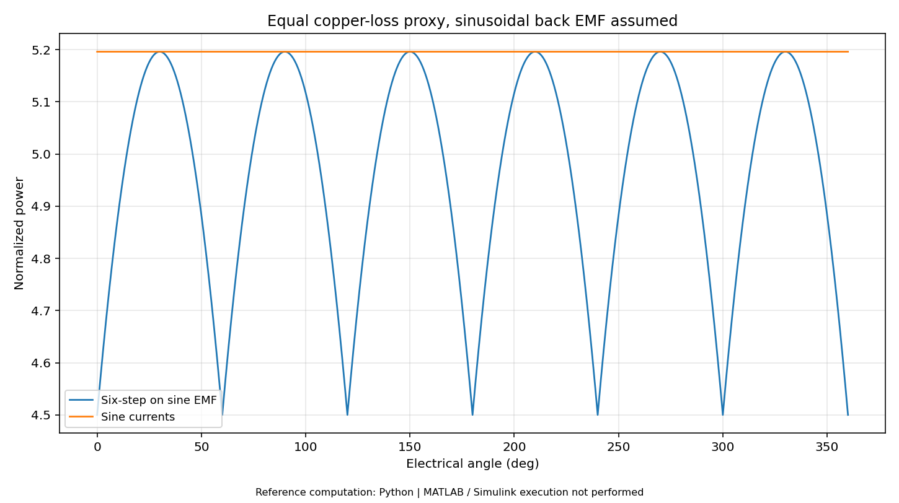

# 第02册｜六步换相 · 异步与步进电机

> 《电机控制：原理、案例与MATLAB实验》 · 版本1.0 · 2026-09-27  
> 原题范围：Q017, Q018, Q019, Q020, Q021, Q022, Q023, Q024, Q153, Q154, Q155, Q156, Q157, Q158, Q159, Q160  
> 本册对应实验：[L03 六步与正弦电流的波形匹配](14_MATLAB实验逐步手册.md#lab03)；[L23 异步转差与步进静态偏差](14_MATLAB实验逐步手册.md#lab23)

[返回总览](00_学习总览与环境指南.md) · [200题索引](99_200题分册与实验索引.md) · [实验手册](14_MATLAB实验逐步手册.md) · [验证边界](16_验证记录与已知边界.md)

**阅读方式：**先读下面连贯教程，再看原题逐项讲解与新增案例，最后按实验手册运行和改参数。正文所有数值模型为教学设定，不是你的电机实测参数。原题答案完整保留其主体内容，并补充新的案例与验证任务；不是只按标题切割原文件。

**执行边界：**本包的47张结果图来自独立Python参考实现。MATLAB主实验源码共24项，未在交付环境原生执行；扩展任务、PLL/HFI和动态弱磁等未完成项均明确标注。基础MATLAB实验不要求专业控制工具箱，Simulink入门模型另需Simulink。

## 一、六步控制：先沿实际电流路径思考

三相桥的合法开关组织与电机电流路径不是同一件事。以 `A+ B-` 为例，主导通路径从母线正端经 A 上桥臂、A/B 绕组、B 下桥臂回到负端；PWM 关断后，电感电流通过允许的开关或二极管续流。其方向不能瞬间改变。C 相被用作浮相观察，也不意味着它完全不受寄生电容和二极管钳位影响。

一个用于说明顺序的六步表为：

| 区间 | 主电流方向 | 浮相 |
|---|---|---|
| 1 | A+、B− | C |
| 2 | A+、C− | B |
| 3 | B+、C− | A |
| 4 | B+、A− | C |
| 5 | C+、A− | B |
| 6 | C+、B− | A |

它不能直接作为任何硬件的通用霍尔查表。具体霍尔极性、绕组相序、零点和方向必须标定。L03 根据瞬时相反电动势选择最大和最小相，用来研究理想电流组织与功率纹波，而不是实现某一 MCU 的霍尔表。[S10]

## 二、六步与正弦：比较之前先固定公平条件

对于给定反电动势 $e_a,e_b,e_c$，瞬时电磁转换功率近似为：

$$P_{em}=e_ai_a+e_bi_b+e_ci_c.$$

若比较一套“两相 ±I”电流与一套“峰值也是 I”的正弦电流，平均铜耗并不相同。六步两相组织有 $i_a^2+i_b^2+i_c^2=2I^2$；平衡正弦电流有 $\tfrac32I_{pk}^2$。使这两个值一致应取 $I_{pk}=2I/\sqrt3$。

L03 正是使用这一约束。它指定正弦反电动势，不模拟有限电感造成的换相重叠。默认六步方案的相对峰峰功率纹波约 14.03%，正弦方案在理想数值下接近常值。**不能把这个数字当作所有 BLDC 的六步转矩纹波，更不能推断 FOC 对任何梯形反电动势电机都一定更优。**正确结论是：反电动势形状与电流形状匹配，会改变功率和转矩波动。

### 实验扩展

保留铜耗约束，把反电动势改成可调梯形并逐渐改变平顶宽度。重新画功率，再加入有限换相时间。此时你能分别辨认“波形设计不匹配”和“电流转移不够快”两类纹波来源。扩展代码需要自行增加，基础 L03 不包含梯形模型。

## 三、无感六步启动为何不能一步闭环

静止时没有足够旋转反电动势，过零判据失去依据。合理状态序列可以是：静止/风车检查 → 限流预定位 → 开环加速 → 连续过零可信判定 → 相位对齐 → 闭环换相。每一步都需要超时和失败分支。

传统理想 120° 六步组织里，浮相反电动势过零与下一换相点约相差 30° 电角度。若电频率为 200 Hz，则一个电周期 5 ms，30° 对应约 416.7 μs。滤波和采样已经拖后 80 μs 时，再机械等待 416.7 μs，会进一步拖后。变速期间还需根据最近扇区时间调整，而非只用一个固定时间。[S10]

接管不能只判断“测到一次过零”。可要求方向一致、连续多个扇区、过零间隔与加速度边界相容、相电流和母线在范围内。高负载时即使估计速度看着正确，相位也可能已经落后，造成过流。L19 的故障锁存方法可迁移到这种启动管理，但本包没有交付完整六步无感启动控制器。

## 四、异步电机：转差不是坏掉的同步

对 $p$ 对极、电频率 $f$，同步机械速度为 $n_s=60f/p$。定义转差 $s=(n_s-n_r)/n_s$。例如四极即两对极，50 Hz 时同步速度 1500 rpm，转子 1450 rpm 时 $s=3.33\%$。相对运动感应出转子电流，从而形成转矩。

L23 用归一化转矩—转差曲线展示低转差区域、最大转矩点和更高转差区域。其形状采用简化近似，不能替代包含转子电阻、电抗、磁链动态与饱和的完整异步电机模型。V/F 控制大致维持磁链，但低频电阻压降不可忽略；矢量控制则进一步估计并定向磁链。对异步电机，转子机械角度并不自动等于磁链角度。[S01][S08]

## 五、步进电机：命令细分不等于实际精度

用静态近似 $T=T_{max}\sin(N_r\delta)$ 表示电磁转矩与机械负载角的关系。负载为 $0.3T_{max}$、$N_r=50$ 时，平衡负载角为：

$$\delta=\frac{\arcsin(0.3)}{50}=0.3492^\circ.$$

若整步角 1.8°，16 细分的命令步长为 0.1125°。负载引起的静态偏移已超过三个细分。因此细分首先改善命令分辨率、平滑性和电流波形，不能独立保证同等绝对定位精度。L23 把负载比例与偏移画出；磁路非线性、摩擦、制造误差和电流误差还未纳入。[S14]

衰减模式则是绕组电流调节问题：快速衰减有利于电流迅速下降，但纹波与噪声可能增加；慢衰减较平缓却可能无法跟随下降参考；混合策略在两者之间取舍。它与位置细分表有关，却不能混同于“增加细分位数”。

## 六、如何学到能迁移，而不只会一种电机

拿到新的电机类型，依次写出：状态变量、可测量量、电压方程、转矩表达、位置依赖性、启动信息来源和安全限制。六步、FOC、V/F、步进细分、开关磁阻导通角控制，都是在各自物理模型与硬件约束下的选择，而不是从低级到高级的一条单向排行榜。

## 本册代表结果预览

**图示解读：**相同铜耗代理量下的转换功率；仅适用指定正弦反电动势。 

> 此图为交付环境中实际执行的 **Python数值参考**。对应MATLAB源码已提供，但本次没有MATLAB/Simulink原生执行。

## 原题逐项精讲与新增案例

以下保留原题的参考回答、前提、追问与易错点；每题补充独立案例和可执行实验或纸面推演任务。原答案提到的附录A—E保存在[原题备份](../source/original_question_bank.md#appendix-a)中；本套新实验不依赖其中的C代码。

 | 题号 | 主题 |
|---|---|
| [Q017](#q017) | 六步换相的六个状态如何排列？ |
| [Q018](#q018) | 两相导通、一相悬空时电流怎么流？ |
| [Q019](#q019) | 120° 导通与 180° 导通有什么区别？ |
| [Q020](#q020) | 霍尔信号如何映射换相表？哪些组合异常？ |
| [Q021](#q021) | 无感六步换相怎样检测反电动势过零？ |
| [Q022](#q022) | 反电动势过零后为什么通常还要延迟换相？ |
| [Q023](#q023) | 静止时无反电动势，无感六步怎么启动？ |
| [Q024](#q024) | 如何处理反转、顺风/逆风启动和换相失败？ |
| [Q153](#q153) | 异步电机转差率、同步转速和转子速度怎样关联？ |
| [Q154](#q154) | V/F 为什么低频要补偿？与矢量控制有什么不同？ |
| [Q155](#q155) | 异步电机转子磁链定向与 PMSM 有什么不同？ |
| [Q156](#q156) | 经典 DTC 与 FOC 有何区别？ |
| [Q157](#q157) | 步进电机为什么失步？ |
| [Q158](#q158) | 细分提高什么？为什么不自动提高定位精度？ |
| [Q159](#q159) | 快衰减、慢衰减、混合衰减怎样影响步进电流？ |
| [Q160](#q160) | 开关磁阻电机怎样产生转矩？为什么关注导通角？ |

---

### Q017. 六步换相的六个状态如何排列？

**参考回答：**一个示例顺序是 `A+ B- → A+ C- → B+ C- → B+ A- → C+ A- → C+ B-`，每步跨越 60° 电角度；具体顺序必须与相线定义、霍尔顺序和期望旋转方向一致，不能无条件复制。

“+/-”表示这一状态下的电流或桥臂作用方向，不是说相端对地电压永远保持正/负。PWM 导通和续流期间，实际电流路径会切换。

**自测要求：**任选一步，画出主导通路径、关断续流路径、悬空相和有效反电动势测量时刻。

#### 新增案例：把原理放进具体情境

给定顺序 A+B−→A+C−→B+C−，需要与绕组和转子位置配合；同样的文字顺序在交换相线后可能产生相反转向。开关表正确并不代表角度参考正确。

#### MATLAB验证 / 工程推演任务

在 L03 中输出每个时刻的正相和负相，整理六个区间。然后只交换 B/C 标号，分析转向和波形，而不是同时改多项配置。

---

### Q018. 两相导通、一相悬空时电流怎么流？

**参考回答：**以 A 上管与 B 下管形成主导通为例，电流可由母线正端经 A 上管、A/B 绕组和 B 下管回到负端。进入 PWM 关断阶段后，绕组电感使电流不能瞬间归零，会通过被允许的同步整流开关或体二极管续流。

具体路径取决于 PWM 加在哪个开关、是否互补驱动、当前电流方向和续流方式。悬空相也可能受寄生电容与二极管钳位影响，并非理想无干扰节点。

**易错点：**只会画直流主导通路径，不知道关断期间为什么仍有相电流。

#### 新增案例：把原理放进具体情境

A 上管与 B 下管关断的一瞬间，绕组电流不会立刻变为零。续流路径取决于同步整流与二极管状态，测到开关节点电压跳变不能直接推断相电流反向。

#### MATLAB验证 / 工程推演任务

选择一个换相区间，分别手绘 PWM 导通、关断续流和死区路径。L06 只有理想电压波形，不能提供真实二极管恢复电流。

---

### Q019. 120° 导通与 180° 导通有什么区别？

**参考回答：**传统 120° 六步方式中，每一桥臂开关的有效导通区间按 120° 电角度组织，通常两个相支路参与主电流路径、另一个相端用于浮相测量。180° 导通组织中每个开关跨越更长的电角区间，通常三相端子都连接到某一母线轨。

两者在电压波形、谐波、转矩波动、利用率和位置估计可用信号上不同。比较时必须说明是否叠加 PWM、采用何种续流和控制目标。

**易错点：**把“每个开关导通 120°”等同于“电机只工作三分之二时间”。

#### 新增案例：把原理放进具体情境

120° 与 180° 导通描述开关状态跨越的电角范围，不等于“电机工作时间百分比”。120° 浮相窗口常用于反电动势测量，180° 组织下可用测量条件不同。

#### MATLAB验证 / 工程推演任务

在一张 0–360° 电角表中写出三个相端连接状态，再标出可观察浮相的区段。不要直接将 L06 的连续 PWM 波形称为传统六步 180° 电流。

---

### Q020. 霍尔信号如何映射换相表？哪些组合异常？

**参考回答：**先低能量标定霍尔状态序列、相序和旋转方向，再建立“霍尔码→对应桥臂状态”的映射；还要校验状态切换是否符合相邻扇区关系，以及超时是否与速度相容。

对常见 120° 电角度布置，`000/111` 常被视为无效码；但其他霍尔布置和极性组合可能不同，不能在不了解机械布置时直接使用该规则。正确的无效状态集合来自具体配置与标定。

**追问：**合法码突然跳到非相邻扇区怎么办？结合加速度上限、采样延迟和毛刺滤波判断，不能简单把所有跳变解释为真实高速转动。[S06]

#### 新增案例：把原理放进具体情境

常见 120° 霍尔排列中 000/111 常被视为异常，但若硬件布置或极性不同，合法码集合也可能不同。合法码跳到非相邻扇区仍值得检查。

#### MATLAB验证 / 工程推演任务

编写合法状态集合和合法转移集合两个独立表，用“合法码但非法跳转”的样例测试。不要只验证码值落在 1–6。

---

### Q021. 无感六步换相怎样检测反电动势过零？

**参考回答：**在合适的浮相与 PWM 状态下，把浮相电压与重建中性点或适当参考比较，寻找反电动势过零时刻。实现需要处理分压、母线变化、换相消隐、开关毛刺和数字确认。

并非任何时刻都能把“浮相端电压等于半母线”当作严格判据；PWM 模式、电流续流和中性点漂移决定具体采样方法。

**工程落点：**观察浮相模拟波形、比较参考、有效窗口和判定输出四者的对应关系，而不是只看最后的换相中断。

#### 新增案例：把原理放进具体情境

PWM 开关瞬态使浮相端电压短暂跨越比较阈值，可能制造虚假的过零事件。先消隐并确认采样状态，再讨论阈值和数字滤波，否则越敏感越容易误换相。

#### MATLAB验证 / 工程推演任务

给一个合成反电动势叠加窄脉冲，比较裸过零与连续确认判据。该扩展不是 L12 的 SMO，二者测量对象不同。

---

### Q022. 反电动势过零后为什么通常还要延迟换相？

**参考回答：**在理想梯形反电动势、传统 120° 六步组织下，浮相过零相对下一理想换相点通常差 30° 电角度。因此常用最近的扇区时间估算延迟；高速、电感、负载以及滤波延迟可能需要调整提前角或补偿。

30° 是这一模型与状态定义下的结果，不是所有无感电机、所有电压采样策略的通用固定时间。转速变化时，时间延迟也必须随估计速度更新。

**追问：**滤波拖后 10°，还额外延迟完整 30° 会怎样？实际换相进一步滞后，可能增大电流和失步风险。

#### 新增案例：把原理放进具体情境

电频率 200 Hz 时 30° 电角时间约 416.7 μs。若测量滤波已经延迟 80 μs，继续额外等待完整 416.7 μs 会使实际换相进一步滞后。

#### MATLAB验证 / 工程推演任务

列出 f=100、200、500 Hz 对应的 30° 时间，并将固定 80 μs 转换成电角度；说明为什么固定时间补偿不适用于全速域。

---

### Q023. 静止时无反电动势，无感六步怎么启动？

**参考回答：**常见流程是检查停转/风车状态，必要时预定位，再按限制电流与斜坡频率开环拖动，待反电动势和连续过零可信后接管闭环。部分方案可通过脉冲响应辨识初始位置，减少反向预动。

启动需要协调初始转矩、负载惯量、加速度和限流。开环频率爬升过快会使转子跟不上，过慢或电压过高会发热；不能以一次空载成功证明带载启动可靠。

**验收建议：**记录供电上下限、温度、初始角度和负载变化下的成功率以及最大电流，而不只记录启动时间。

#### 新增案例：把原理放进具体情境

开环频率爬升得比转子能达到的加速度更快，转子会落后并可能大电流，而不是“多给一点电压就一定跟上”。重载启动需要电流、惯量与观测可信度一起约束。

#### MATLAB验证 / 工程推演任务

用机械方程估算可用转矩下的加速度上限，再拟定开环频率斜坡和失败超时。当前包不包含完成的六步无感启动仿真，需先做状态推演。

---

### Q024. 如何处理反转、顺风/逆风启动和换相失败？

**参考回答：**启动前先判断是否已经旋转、方向和速度。顺向风车状态可尝试同步接入；逆向状态需要按母线吸能能力制动、等待或受控反转，不能把正常静止启动序列强行接入高速反转电机。

换相失败应限制能量，记录过零丢失、估计转速、母线与电流，进入预定故障状态。重新启动要有次数、间隔、温度和机械条件约束。

**易错点：**失步后不停加大占空比，或者无限循环自动重试。两者都可能把控制失配转变为硬件损坏。

#### 新增案例：把原理放进具体情境

风机已经被外部气流带着反转，此时从静止预定位强行启动可能造成大制动电流和母线回灌。顺风、逆风和静止必须是不同入口。

#### MATLAB验证 / 工程推演任务

先用 L18 算反转动能，再用 L19 的故障优先模式画三条启动分支。为重试写清次数、间隔与允许温度，不使用无限自动重启。

---

### Q153. 异步电机转差率、同步转速和转子速度怎样关联？

**参考回答：**同步机械转速为 $n_s=60f/p$，转差率 $s=(n_s-n_r)/n_s$，因此 $n_r=(1-s)n_s$。电动状态下通常 $0<s<1$，启动静止时在该定义下 s=1。

转差不是一个所有负载都固定不变的常数；磁链、负载、电源和控制策略都会影响它。发电或其他工况也会出现不同符号与范围。

**追问：**为什么负载增加时转速可能略降？在相应供电与控制条件下，需要更大转差以建立相应转子电流与转矩。

#### 新增案例：把原理放进具体情境

4极电机即2对极，50Hz同步转速1500rpm。1450rpm时转差3.33%，若超过同步速度则可能进入不同能量象限。

#### MATLAB验证 / 工程推演任务

用L23把正负转差分开标注，说明简化曲线的符号约定与适用范围，不把额定1450rpm当所有4极电机的固定值。

---

### Q154. V/F 为什么低频要补偿？与矢量控制有什么不同？

**参考回答：**基波近似下保持电压/频率有助于保持磁链，但低频时电阻压降相对显著，单纯同比降低电压可能使有效磁链不足，因此可能需要低频补偿。

V/F 更偏标量调节，通常不直接实现定向的磁链/转矩解耦；矢量控制利用电流、位置/磁链信息调节更明确的分量，动态能力和实现要求不同。

**易错点：**给所有频率固定电压补偿而不防过磁或过流，也不能把 PMSM 和异步电机的所有标量启动行为混同。[S01]

#### 新增案例：把原理放进具体情境

低频降低电压以保持V/f时，绕组电阻压降占比增大，实际磁链可能下降；补偿需要电流和参数信息，不能固定乘一个比例适用于所有负载。

#### MATLAB验证 / 工程推演任务

画理想线性V/f与带低频补偿的示意曲线，标为控制参考而非实测磁链；本包没有完整异步动态模型。

---

### Q155. 异步电机转子磁链定向与 PMSM 有什么不同？

**参考回答：**PMSM 永磁磁链与转子结构相关，机械角经极对数和偏置可得到转子磁链角；异步电机的转子磁链需要由电磁过程建立，其同步磁链角与机械角之间还包含转差角速度。

因此异步 FOC 需要估计或计算磁链、转差，并对转子时间常数等参数敏感。不能把 PMSM 的编码器电角度直接代入就完成相同的磁链定向。

**工程落点：**先定义定向对象、磁链模型与参数，再讨论解耦和整定。[S01]

#### 新增案例：把原理放进具体情境

PMSM永磁磁链与转子电角位置相连，异步转子磁链还含滑差动态。把编码器机械角乘极对数直接用于异步转子磁链定向通常少了必要信息。

#### MATLAB验证 / 工程推演任务

写异步定向需要的磁链角与滑差关系，再对照L11明确哪些模块不能直接复用。

---

### Q156. 经典 DTC 与 FOC 有何区别？

**参考回答：**经典 DTC 常从估计的转矩和磁链误差出发，通过滞环比较和开关表选电压矢量；FOC 常在 dq 坐标下控制电流并通过调制生成电压。两者都可实现转矩控制，但控制结构和波纹/开关行为不同。

现代 DTC 还有结合 PI、预测或 SVPWM 的变体，不能把经典 DTC 的可变开关频率等特征说成所有 DTC 的必然属性。

**追问：**哪种一定更快更好？需指定实现、采样、模型、约束和测试指标，不适合脱离条件作绝对判断。[S01]

#### 新增案例：把原理放进具体情境

DTC直接围绕磁链和转矩误差选电压作用，FOC则在定向坐标控制电流；具体调制、采样和实现变体影响纹波及频率。

#### MATLAB验证 / 工程推演任务

画两种控制的信息流，不用“一个一定更快”代替条件分析；本包没有DTC与FOC公平数值对照实验。

---

### Q157. 步进电机为什么失步？

**参考回答：**开环步进依靠转子跟随励磁平衡点移动。所需加速转矩加负载转矩超过当前转速下可用转矩，或受到共振、供电和电流建立速度影响时，转子可能跟不上，实际位置与指令步数分离。

高速时电感与反电动势限制绕组电流建立，保持转矩不能代表高速能力。加减速规划、合适驱动电压与电流控制、机械阻尼和反馈可改善。

**易错点：**认为只要脉冲计数正确就能保证机械位置正确；开环系统没有独立证明未失步的能力。

#### 新增案例：把原理放进具体情境

步进电机加速度太大或高速可用转矩下降时，转子可能跟不上命令而失步。增加微步数不能补足动力学转矩。

#### MATLAB验证 / 工程推演任务

将所需Jα与转速下可用转矩画在一起，再用L23讨论静态负载角与动态失步区别。

---

### Q158. 细分提高什么？为什么不自动提高定位精度？

**参考回答：**细分用更平滑的两相电流比例产生更多中间平衡位置，改善指令分辨率、平顺性和部分噪声表现。但实际角度还受电机磁路误差、负载、摩擦和电流比例误差影响。

细分越细，每个微步对应的增量恢复转矩越小，负载可能让多个微步才体现明显机械移动。因此“256 细分”不等于真实绝对位置精度就是整步角除以 256。

**工程落点：**用独立位置测量验证负载下的微步线性和重复性。[S14]

#### 新增案例：把原理放进具体情境

1.8°整步、16细分给0.1125°命令步长；0.3Tmax负载下本例静态偏移约0.349°。命令更细不保证位置同样准确。

#### MATLAB验证 / 工程推演任务

运行L23并逐步增加负载，比较偏移与一个微步的大小，写清模型忽略的摩擦和制造误差。

---

### Q159. 快衰减、慢衰减、混合衰减怎样影响步进电流？

**参考回答：**在斩波电流控制中，开关关断后的续流路径决定绕组电流下降速度。慢衰减通常使电流较慢衰减，可能在目标快速下降时跟不上；快衰减可更快降低电流，但纹波和噪声取舍不同；混合衰减结合两个阶段。

具体电流方向与路径由桥式拓扑和器件实现决定。应结合驱动电压、电感、速度和目标正弦波检查实际电流波形。

**追问：**为什么同一电机低速正弦电流畸变？除了细分表，还要检查衰减模式、最小导通时间与采样消隐。

#### 新增案例：把原理放进具体情境

电流参考下降时，慢衰减可能来不及释放能量，造成波形畸变；快衰减使下降更快但可能增加纹波。问题首先是绕组电压与电流变化率。

#### MATLAB验证 / 工程推演任务

用RL方程比较零电压续流与反向电压的下降斜率，注意真实桥中二极管压降和驱动策略未纳入该简化。

---

### Q160. 开关磁阻电机怎样产生转矩？为什么关注导通角？

**参考回答：**转子倾向于向磁阻较小、相电感较大的方向运动。在简化未饱和单相表达下，$T\approx\tfrac12i^2\,dL/d\theta_m$。因此电流应与电感上升/下降区间配合，转矩符号与导通位置密切相关。

高速时电流建立和衰减需要时间，开通/关断角影响正转矩区利用、负转矩、效率和转矩脉动。实际饱和模型应通过磁共能或磁链图分析，不宜一直套线性公式。

**易错点：**把 SRM 的励磁角和 PMSM 的 Park 角度当作同一件事，或者直接照搬 PMSM 三相逆变器控制逻辑。

#### 新增案例：把原理放进具体情境

开关磁阻机转矩与电感随位置变化有关，导通在不合适区域可能得到制动转矩。它不使用PMSM永磁转矩常数的同一公式。

#### MATLAB验证 / 工程推演任务

用假设L(θ)曲线画dL/dθ，并结合T≈0.5i²dL/dθ解释导通区；明确是线性磁路近似，不是完整SRM设计。

---

## 本册完成检查

能否在不看答案时解释本册核心因果链？能否先预测改参数后曲线往哪个方向变化？能否指出模型省略的物理因素？把实际结果、失败条件和剩余问题填写到[实验报告模板](../templates/01_实验报告模板.md)。原理理解、MATLAB运行、目标MCU和实机验证是不同完成状态，不合并打勾。

## 引用与进一步阅读

方括号S编号沿用原题官方资料；N编号是本次新增的官方软件接口资料。详见[资料与符号](15_参考资料与符号约定.md)。具体公式、教学案例与实验代码为本教程组织和推导，模型结果只适用于所列条件。

[S01]: https://www.mathworks.com/help/mcb/vector-control-foc-and-dtc.html
[S02]: https://www.mathworks.com/help/mcb/gs/obtain-controller-gains-foc-example.html
[S03]: https://www.mathworks.com/help/mcb/ref/mtpacontrolreference.html
[S04]: https://www.mathworks.com/help/mcb/ref/pwmreferencegenerator.html
[S05]: https://www.mathworks.com/help/mcb/ug/prepare-task-scheduling.html
[S06]: https://www.mathworks.com/help/mcb/sensor-calibration.html
[S07]: https://www.mathworks.com/help/mcb/sensorless-approach.html
[S08]: https://www.mathworks.com/help/mcb/motor-parameter-estimation-and-plant-modelling.html
[S09]: https://www.mathworks.com/help/mcb/deployment-and-validation.html
[S10]: https://wiki.st.com/stm32mcu/wiki/STM32MotorControl:Introduction_to_Motor_Control_with_STM32
[S11]: https://docs.odriverobotics.com/v/latest/manual/control.html
[S12]: https://docs.odriverobotics.com/v/latest/manual/hardware-config.html
[S13]: https://www.can-cia.org/can-knowledge/cia-402-series-canopen-device-profile-for-drives-and-motion-control
[S14]: https://www.analog.com/en/resources/analog-dialogue/articles/mastering-precision-understanding-microstepping.html
[S15]: https://www.ti.com/lit/SLYT762
[S16]: https://www.ti.com/lit/an/slva959b/slva959b.pdf
[S17]: https://www.mathworks.com/help/mcb/ref/surfacemountpmsm.html
[S18]: https://www.mathworks.com/help/mcb/ref/parktransform.html
[S19]: https://www.mathworks.com/help/mcb/ref/clarketransform.html
[S20]: https://www.mathworks.com/help/mcb/ref/fieldorientedcurrentcontroller.html
[S21]: https://www.mathworks.com/help/mcb/gs/field-weakening-control.html
[S22]: https://www.can-cia.org/can-knowledge/can-fd-the-basic-idea
[S23]: https://www.mathworks.com/help/mcb/ref/slidingmodeobserver.html
[S24]: https://www.mathworks.com/help/mcb/ref/fluxobserver.html
[S25]: https://www.mathworks.com/help/mcb/ref/extendedemfobserver.html
[S26]: https://www.mathworks.com/help/mcb/ref/pulsatinghighfreqobserver.html
[S27]: https://search.abb.com/library/Download.aspx?Action=Launch&DocumentID=3AXD50000035169&DocumentPartId=&LanguageCode=en
[S28]: https://www.beckhoff.com/en-en/products/i-o/ethercat-terminals/el-ed6xxx-communication/el6692.html
[N01]: https://www.mathworks.com/help/simulink/ug/integrate-ccode-ccaller.html
[N02]: https://www.mathworks.com/matlabcentral/fileexchange/183591-simulink-support-package-for-rust-code
[N03]: https://www.mathworks.com/help/simulink/slref/add_block.html
[N04]: https://www.mathworks.com/help/simulink/slref/sim.html
