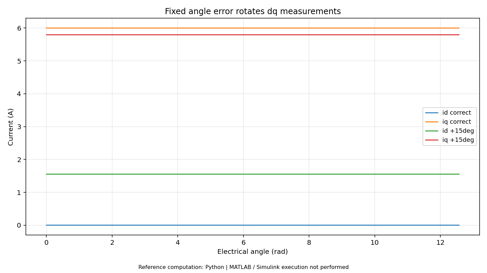

# 第03册｜坐标变换 · PMSM数学模型

> 《电机控制：原理、案例与MATLAB实验》 · 版本1.0 · 2026-09-27  
> 原题范围：Q025, Q026, Q027, Q028, Q029, Q030, Q031, Q032, Q033, Q034, Q035, Q036, Q037, Q038, Q039, Q040  
> 本册对应实验：[L04 Clarke/Park与角度偏差](14_MATLAB实验逐步手册.md#lab04)；[L05 PMSM耦合模型与功率平衡](14_MATLAB实验逐步手册.md#lab05)

[返回总览](00_学习总览与环境指南.md) · [200题索引](99_200题分册与实验索引.md) · [实验手册](14_MATLAB实验逐步手册.md) · [验证边界](16_验证记录与已知边界.md)

**阅读方式：**先读下面连贯教程，再看原题逐项讲解与新增案例，最后按实验手册运行和改参数。正文所有数值模型为教学设定，不是你的电机实测参数。原题答案完整保留其主体内容，并补充新的案例与验证任务；不是只按标题切割原文件。

**执行边界：**本包的47张结果图来自独立Python参考实现。MATLAB主实验源码共24项，未在交付环境原生执行；扩展任务、PLL/HFI和动态弱磁等未完成项均明确标注。基础MATLAB实验不要求专业控制工具箱，Simulink入门模型另需Simulink。

## 一、坐标变换不是把电机“变成直流”，而是换观察角度

可以把 αβ 坐标系想成固定在定子上的两根正交坐标轴，把 dq 坐标系想成跟随转子永磁磁链旋转的尺子。同一根电流矢量，在固定尺子上不断变化，在同速旋转的尺子上可以保持不变。实际相电流仍然是交流，改变的是数值表达。

在零序为零条件下采用等幅值 Clarke：

$$\begin{bmatrix}i_\alpha\\i_\beta\end{bmatrix}=\frac23
\begin{bmatrix}1&-1/2&-1/2\\0&\sqrt3/2&-\sqrt3/2\end{bmatrix}
\begin{bmatrix}i_a\\i_b\\i_c\end{bmatrix}.$$

再做 d 轴与 α 轴在零角时重合的 Park：

$$\begin{bmatrix}i_d\\i_q\end{bmatrix}=
\begin{bmatrix}\cos\theta_e&\sin\theta_e\\-\sin\theta_e&\cos\theta_e\end{bmatrix}
\begin{bmatrix}i_\alpha\\i_\beta\end{bmatrix}.$$

反变换使用旋转矩阵的转置。先拿 $\theta_e=0,\pi/2,\pi$ 手算，再跑随机往返测试；这比一开始就把三角函数优化成查表更重要。不同库可能有 q 轴对齐选项和不同缩放，需要整套接口一致。[S18][S19]

## 二、15° 偏角到底怎样变成错误电流

设估计角比真实角超前 $\delta$：

$$\begin{bmatrix}i_{d,meas}\\i_{q,meas}\end{bmatrix}=
\begin{bmatrix}\cos\delta&\sin\delta\\-\sin\delta&\cos\delta\end{bmatrix}
\begin{bmatrix}i_{d,true}\\i_{q,true}\end{bmatrix}.$$

当真实 $i_d=0,i_q=6A$、$\delta=15^\circ$，测量坐标里得到 $i_d=1.5529A,i_q=5.7956A$。L04 的图展示的正是“真实电流不变，观察坐标错误”。

L11 则让控制器继续闭环，把**错误坐标系下的** d 电流调到零，于是真实电流矢量被控制器转向，真实 d 电流可能为负。两个实验的符号现象不同并不矛盾：一个仅变换数据，一个让变换误差反过来改变物理对象。这是学习控制时最重要的“开环测量误差”与“闭环补偿后真实状态”区别之一。

### 建议验证

在 L04 中将偏角改成 −15°、30°，先手算再运行。不要更改其他参数。然后运行 L11，比对 `normal`、`angle_offset` 两组真实 d 电流，记录偏角注入前后变化；不能只看控制器内部“测量 d 电流接近零”。

## 三、为什么旋转坐标里出现交叉耦合

静止坐标中的电压关系可写作 $\boldsymbol v=R\boldsymbol i+d\boldsymbol\lambda/dt$。磁链向量投影到旋转坐标后，求导不仅要计算磁链分量变化，还要计算坐标轴本身旋转。若记 $J_2=\begin{bmatrix}0&-1\\1&0\end{bmatrix}$，相应增加 $\omega_eJ_2\boldsymbol\lambda$ 项。

取 $\lambda_d=L_di_d+\psi_f,\lambda_q=L_qi_q$：

$$v_d=Ri_d+L_d\dot i_d-\omega_eL_qi_q,$$
$$v_q=Ri_q+L_q\dot i_q+\omega_e(L_di_d+\psi_f).$$

因此 d 轴电压会受 q 电流影响，q 轴电压会受 d 电流和永磁磁链影响。忽略这些项不一定马上失稳，PI 可能通过积分抵消部分稳态影响；但高速动态和电压利用会变差。L05 提供恒速外部驱动条件下的耦合电流对象。[S17][S20]

## 四、用功率平衡校验整个模型

同一套等幅值变换下：

$$P_e=\frac32(v_di_d+v_qi_q),\quad P_{cu}=\frac32R(i_d^2+i_q^2),$$
$$W_L=\frac34(L_di_d^2+L_qi_q^2),$$
$$T_e=\frac32p[\psi_fi_q+(L_d-L_q)i_di_q].$$

将电压方程代入，应满足：

$$P_e-P_{cu}-\dot W_L-T_e\omega_m=0.$$

L05 以模型导数直接计算瞬时功率残差，默认 Python 参考结果最大约 $2.84\times10^{-14}W$。这验证的是**当前线性模型的符号、系数与能量一致性**，不意味着真实电机损耗模型的误差也是这么小；模型没有铁耗、机械附加损耗和饱和。

独立地，还应通过减半积分步长检查电流轨迹收敛。功率恒等式可用同一组错误但自洽的方程“自证”，所以它不能代替实测参数与实验验证。

## 五、一个稳态工作点逐项拆算

取 $\omega_m=100rad/s,p=4,i_d=0,i_q=4A$，则 $\omega_e=400rad/s$。本教程 SPMSM 所需：

$$v_d=-400\times0.0004\times4=-0.64V,$$
$$v_q=0.2\times4+400\times0.02=8.8V.$$

转矩 $0.48Nm$，转换功率 48 W，铜耗 4.8 W，因此输入有功功率为 52.8 W。把 dq 电压电流代入 $\tfrac32(v_di_d+v_qi_q)$ 也得到 52.8 W。这个案例把“为什么 q 轴要补反电动势”“为什么 d 轴零电流仍需要非零电压”“母线电流不等于相电流”连接起来。

## 六、参数怎样从仪器数值进入模型

模型相电阻不是两根线端子间直接测到的值；$L_d/L_q$ 也不是所有位置和偏置下相同的 LCR 数字。记录原始测量连接、转子角、频率、温度和电流，再说明如何转换。对凸极和饱和电机，进一步用磁链图 $\lambda_d(i_d,i_q),\lambda_q(i_d,i_q)$ 代替常数电感；本包只提供常数参数教学模型，不能把它当作高精度电磁有限元模型。[S08]

## 本册代表结果预览



**图示解读：**固定真实电流在正确/错误坐标中的投影差异。 

> 此图为交付环境中实际执行的 **Python数值参考**。对应MATLAB源码已提供，但本次没有MATLAB/Simulink原生执行。

## 原题逐项精讲与新增案例

以下保留原题的参考回答、前提、追问与易错点；每题补充独立案例和可执行实验或纸面推演任务。原答案提到的附录A—E保存在[原题备份](../source/original_question_bank.md#appendix-a)中；本套新实验不依赖其中的C代码。

 | 题号 | 主题 |
|---|---|
| [Q025](#q025) | 画出一套有传感器 PMSM FOC 框图。 |
| [Q026](#q026) | Clarke 变换为什么能把三相变成两相？ |
| [Q027](#q027) | Park 变换为什么用电角度？ |
| [Q028](#q028) | d 轴和 q 轴相对哪个磁场定义？ |
| [Q029](#q029) | 交流相电流为什么在 dq 中近似变成直流？ |
| [Q030](#q030) | 等幅值与等功率 Clarke/Park 有什么区别？ |
| [Q031](#q031) | 相序、编码器方向或零点错误为什么破坏控制？ |
| [Q032](#q032) | FOC 和 SVPWM 是不是同一个算法？ |
| [Q033](#q033) | 写出 PMSM 的 dq 电压方程。 |
| [Q034](#q034) | 电阻项、电感项、交叉项和反电动势项分别是什么？ |
| [Q035](#q035) | 为什么两个电流环不天然独立？ |
| [Q036](#q036) | 前馈解耦怎么写？符号错了会怎样？ |
| [Q037](#q037) | 转矩公式是什么？永磁转矩与磁阻转矩怎么解释？ |
| [Q038](#q038) | 表贴式与内嵌式 PMSM 的 Ld/Lq 有什么差异？ |
| [Q039](#q039) | 为什么 Id=0 并非总是最佳？ |
| [Q040](#q040) | 温度、饱和与交叉饱和如何影响控制？ |

---

<a id="q025"></a>
### Q025. 画出一套有传感器 PMSM FOC 框图。

**参考回答：**核心是电流内环；速度和位置环可按模式选择启用。反馈包括相电流、转子角度、母线电压与必要的保护量。

```text
位置指令 → 位置控制器 → 速度指令 → 速度控制器 → 转矩/Iq 指令
                                             ↓
                                 Id/Iq 参考与限流
                                             ↓
相电流 → 校准 → Clarke → Park → dq 电流误差 → PI + 解耦
                            ↑                       ↓
编码器 → 方向/零点/极对数 → 电角度       电压矢量限幅 + 抗饱和
                            ↓                       ↓
                       角度时间补偿 → 反 Park → SVPWM
                                                      ↓
                               定时器 → 驱动器 → 逆变桥 → 电机
```

**工程补充：**硬件快速关断链独立于上述正常算法；温度、母线和状态机决定运行许可与限值。参考 [S01]、[S20]。

#### 新增案例：把原理放进具体情境

L11 从速度参考到最终占空比全部可追踪。速度能跟上并不代表变换、限幅和电流正确；必须把算法状态和真实对象状态分开看。

#### MATLAB验证 / 工程推演任务

打开 mc_foc_sim.m，给每个数组变量标出物理量和单位，画输入输出表；逐段定位采样、Park、PI、前馈、限幅与反 Park。

---

<a id="q026"></a>
### Q026. Clarke 变换为什么能把三相变成两相？

**参考回答：**三线制且忽略零序通路时，$i_a+i_b+i_c=0$，三个相电流只有两个独立自由度。本文采用等幅值形式：

$$
i_\alpha=\frac23(i_a-\frac12i_b-\frac12i_c),\quad
 i_\beta=\frac{1}{\sqrt3}(i_b-i_c)
$$

在电流和为零时可简化为 $i_\alpha=i_a$、$i_\beta=(i_a+2i_b)/\sqrt3$。它改变坐标表达，不是丢弃一相的物理作用。

**易错点：**有零序电流或测量不同时仍不加说明地套二相简式；三相测量残差也不应在诊断前被强行归零。[S19]

#### 新增案例：把原理放进具体情境

在三线制零序为零时，三相只有两个独立自由度。A 相偏置 0.3 A 后，三路测量和会出现残差；强制推算第三相可能把残差隐藏掉。

#### MATLAB验证 / 工程推演任务

用 L04 的三相数据注入一个偏置，分别做三相 Clarke 与两相简式，比较误差；解释测量残差与真实漏电不是一回事。

---

<a id="q027"></a>
### Q027. Park 变换为什么用电角度？

**参考回答：**Park 将静止 $\alpha\beta$ 坐标投影到跟随转子磁链旋转的 $dq$ 坐标。磁场重复周期由电角度决定，因此直接使用机械角会在多极电机中产生错误旋转速度。

本文规定：

$$
i_d=i_\alpha\cos\theta_e+i_\beta\sin\theta_e,\quad
 i_q=-i_\alpha\sin\theta_e+i_\beta\cos\theta_e
$$

**自测：**当 $\theta_e=0$ 时，d 对齐 α、q 对齐 β；用这一点检验程序与图示。若使用另一种轴方向，公式和控制符号必须整体一致。[S18]

#### 新增案例：把原理放进具体情境

4 对极电机转过 90° 机械角，磁场已完成一次电周期。使用机械角做 Park 时，dq 波形还会持续旋转，PI 面对的便不再是近似直流量。

#### MATLAB验证 / 工程推演任务

在 L04 中用 theta/4 故意替代 theta，观察 dq 纹波。记录错误频率，而不仅写“波形不好”。

---

<a id="q028"></a>
### Q028. d 轴和 q 轴相对哪个磁场定义？

**参考回答：**在本文 PMSM 转子磁链定向中，d 轴对齐转子永磁磁链，q 轴按本文正方向与之相差 90° 电角度。d/q 的命名本身并不保证控制已经解耦，它首先是一套坐标选择。

对于异步电机，可以选择转子磁链、定子磁链等不同定向，不能把所有控制场景都默认成“机械转子位置就是 d 轴”。

**易错点：**说“d 永远不产转矩、q 永远只产转矩”。凸极 PMSM 存在磁阻转矩，d 电流会影响转矩和电压约束。

#### 新增案例：把原理放进具体情境

d 轴是所选定向磁链的方向。PMSM 可以对齐转子永磁磁链，异步机却需考虑转差和磁链估计，不能把两者的角度来源直接互换。

#### MATLAB验证 / 工程推演任务

用三帧不同角度画 d/q 与 αβ 的关系，固定同一电流矢量观察投影。标明正转方向及 q 轴方向。

---

<a id="q029"></a>
### Q029. 交流相电流为什么在 dq 中近似变成直流？

**参考回答：**稳态对称正弦电流形成一个以电角速度旋转的电流矢量；从同速旋转的坐标系观察，其投影不再周期变化，因此表现为近似恒定的 d/q 分量。这样 PI 可以用积分消除常值跟踪误差。

“近似直流”以稳态、角度正确、主要基波为前提。转矩变化、角度误差、电流谐波、采样不同步和死区都会使 dq 出现动态或纹波。

**工程落点：**观察 dq 波纹的频率与机械转频、电频率、采样频率的关系，有助于判断误差来源。

#### 新增案例：把原理放进具体情境

若 αβ 电流恰好以 θe 同速旋转，投影 dq 是常量；速度差很小也会产生缓慢漂移。这说明“看起来像直流”本身不证明角度绝对零位正确。

#### MATLAB验证 / 工程推演任务

在 L04 中增加 1 Hz 的估计角频率误差，观察 dq 缓慢旋转；再只加固定 15° 偏置，比较两类错误形态。

---

<a id="q030"></a>
### Q030. 等幅值与等功率 Clarke/Park 有什么区别？

**参考回答：**两种形式主要区别是缩放系数。等幅值便于使空间矢量幅值对应相电流峰值；功率不变形式使变换前后内积保持相应一致。本文等幅值、零序为零时：

$$
P_e=\frac32(v_di_d+v_qi_q)
$$

采用功率不变缩放后，电流/电压数值、转矩系数和限幅阈值都应相应转换。

**易错点：**从不同开源库各复制一段变换、转矩估算和 SVPWM，最后虽然可以转动，却存在固定比例误差。务必在接口文档写出基值和变换矩阵。

#### 新增案例：把原理放进具体情境

同一物理三相波形，在等幅值和等功率变换中的数值不同；如果只替换变换矩阵而不改限流与转矩系数，会出现固定比例误差。

#### MATLAB验证 / 工程推演任务

用随机平衡电压电流验证 abc 功率等于 1.5 倍 dq 内积；再换成等功率缩放检查内积直接相等。不要把两套电流限值混用。

---

<a id="q031"></a>
### Q031. 相序、编码器方向或零点错误为什么破坏控制？

**参考回答：**控制器以估计的 d/q 轴分解电流并施加电压。如果角度错位，期望的 q 电流会混入 d 轴；方向或相映射错误还可能使负反馈变成正反馈，导致电流快速增加。

小的固定偏置可能表现为低效率、发热和转矩不足；大的偏置或错误方向可能表现为只抖、反转或失稳。不能以“能转”作为标定正确的唯一证据。

**验证建议：**先受控确认相序和编码器方向，再校准零点，最后在低能量条件下检查正负 Iq 与实际转矩方向、Id/Iq 跟踪关系。

#### 新增案例：把原理放进具体情境

开环真实 iq=6 A 时，15° 超前角会测出正的假 id；闭环把错误坐标 id 调成零后，真实 id 可能变负。这是测量错误与闭环响应的区别。

#### MATLAB验证 / 工程推演任务

先算 L04 的 1.5529 A，再看 L11 的偏角模式；用同一旋转矩阵推导两个场景，避免把符号变化误判成代码矛盾。

---

<a id="q032"></a>
### Q032. FOC 和 SVPWM 是不是同一个算法？

**参考回答：**不是。FOC 规定在合适的坐标系中控制电流/磁链与转矩；SVPWM 是把电压矢量转换为逆变器开关占空比的方法。FOC 可搭配其他调制方法，SVPWM 也可为其他控制策略服务。

工程上应分为“控制器输出电压指令”和“调制器实现电压指令”两个接口，并说明母线测量、线性范围、采样窗口、死区和实际实现电压。

**常见追问：**只输出正弦 PWM，没有电流闭环，是不是 FOC？通常不能仅凭波形这样认定，还需看坐标定向和受控物理量。[S01][S04]

#### 新增案例：把原理放进具体情境

只生成正弦占空比，可以让某些电机开环转动，却没有保证电流受控。反过来，FOC 的电压参考也可以采用不同调制方法实现。

#### MATLAB验证 / 工程推演任务

在 L11 中标出 FOC 控制器与 mc_svpwm 的接口，再说明更换调制器时需要重新验证哪些电压限制与采样条件。

---

<a id="q033"></a>
### Q033. 写出 PMSM 的 dq 电压方程。

**参考回答：**本文符号约定下，线性参数模型为：

$$
v_d=R_si_d+L_d\frac{di_d}{dt}-\omega_eL_qi_q
$$
$$
v_q=R_si_q+L_q\frac{di_q}{dt}+\omega_e(L_di_d+\psi_f)
$$

模型忽略饱和、参数随位置变化、额外铁耗支路及逆变器非理想因素。$\omega_e$ 用电角速度 rad/s，不是机械 rpm；电感用 H 而不是原样代入 mH。

**自测要求：**能够从电压平衡解释每一项，知道静止、Id=0 和高速时哪些项占主导。[S17][S20]

#### 新增案例：把原理放进具体情境

机械 100 rad/s、p=4、id=0、iq=4 A 时，课程模型稳态需要 vd=−0.64 V、vq=8.8 V。id 为零并不意味着 vd 为零，因为还要补轴间耦合。

#### MATLAB验证 / 工程推演任务

手算该点，再运行 L05 检查电流向平衡值收敛。用相同公式算 200 rad/s，观察速度相关电压项增大。

---

<a id="q034"></a>
### Q034. 电阻项、电感项、交叉项和反电动势项分别是什么？

**参考回答：**$R_si$ 表示绕组电阻压降；$L\,di/dt$ 描述改变电流所需电压；$-\omega_eL_qi_q$ 与 $+\omega_eL_di_d$ 是旋转坐标系引入的轴间耦合项；$\omega_e\psi_f$ 是永磁磁链的速度电势。

低速大电流时电阻压降重要；电流快速变化时电感项重要；高速时速度相关项占用更多母线裕量。该分解也说明“电机没达到目标电流”可能是电压能力不足，而不一定是 PI 太小。

**追问：**温升后只有哪一项变化？不能只说电阻，磁链和电感也可能变化，取决于温度及磁工作点。

#### 新增案例：把原理放进具体情境

把 iq 从 0 快速升到 4 A，电感项需要额外电压；达到稳态后该项消失，但反电动势仍存在。因此一个工作点的稳态电压不能代表瞬态电压峰值。

#### MATLAB验证 / 工程推演任务

在 L05 或 L11 中分别记录 Riq、Ldiq/dt、速度电势，解释启动与稳态哪个分量主导；导数计算要标明数值方法。

---

<a id="q035"></a>
### Q035. 为什么两个电流环不天然独立？

**参考回答：**从方程可见，d 轴电压需求包含 q 电流，q 轴电压需求包含 d 电流和磁链。速度越高，耦合越明显。两个独立 PI 通过反馈可以抑制部分影响，但动态性能与电压裕量会受限制。

另外，电压矢量限幅把两个轴联系起来；即使线性模型做了理想解耦，某一轴要求更多电压也会压缩另一轴的可用范围。

**易错点：**加入两个 PI 就宣称完全解耦，或者不检查限幅后的真实电压便判断参数效果。

#### 新增案例：把原理放进具体情境

d/q 两个 PI 的输入形式虽然独立，物理对象却含交叉项；再加上总电压圆限制，一个轴用掉更多裕量会限制另一个轴。

#### MATLAB验证 / 工程推演任务

在 mc_foc_sim 的副本中禁用前馈但保留相同 PI，比较高速 iq 阶跃的 id 扰动；不要同时改变带宽。

---

<a id="q036"></a>
### Q036. 前馈解耦怎么写？符号错了会怎样？

**参考回答：**在本文定义下，可令：

$$
v_d^*=u_{PI,d}-\omega_eL_qi_q,
\qquad v_q^*=u_{PI,q}+\omega_e(L_di_d+\psi_f)
$$

使 PI 主要应对电阻—电感动态。使用测量电流、参考电流或预测电流会改变噪声和动态，需要一致设计。速度、参数、角度及延迟有误时只能做到近似补偿。

符号错误可能把耦合放大，因此上线时应先验证基本反馈，再分步启用前馈，并比较相同工况下的电流误差与电压饱和情况。

#### 新增案例：把原理放进具体情境

前馈 vd=−ωeLqiq 的负号若写反，可能把原本要抵消的耦合加倍。低速下效果不明显，高速才暴露，因此只做空载低速测试不足。

#### MATLAB验证 / 工程推演任务

先用解析稳态点验证符号，再进行前馈开/关对照。错误符号仅在仿真副本注入，并保留数值保护断言。

---

<a id="q037"></a>
### Q037. 转矩公式是什么？永磁转矩与磁阻转矩怎么解释？

**参考回答：**本文等幅值正弦模型下：

$$
T_e=\frac32p\left[\psi_fi_q+(L_d-L_q)i_di_q\right]
$$

第一项来自永磁磁链与 q 轴电流；第二项来自 d/q 方向磁阻差异。若 $L_d=L_q$，第二项在该模型下为零。

当常见 IPMSM 有 $L_q>L_d$ 时，合适的负 Id 与正 Iq 可产生正的磁阻转矩，但这不意味着 Id 越负越好，还要考虑总电流、电压、效率与退磁限制。

**易错点：**漏掉极对数或 3/2，却仍使用本书的等幅值电流定义。[S03]

#### 新增案例：把原理放进具体情境

SPMSM 的 Ld=Lq 时磁阻转矩项为零；IPMSM 取 Lq>Ld、负 id、正 iq 时，该项可为正。只看到 iq 变小不能认定电流总量更小。

#### MATLAB验证 / 工程推演任务

用 L13 保存每个最优点的永磁与磁阻两部分转矩，并核对它们之和等于目标；再比较电流矢量幅值。

---

<a id="q038"></a>
### Q038. 表贴式与内嵌式 PMSM 的 Ld/Lq 有什么差异？

**参考回答：**表贴式转子在简化模型中磁路较接近各向同性，常近似 $L_d\approx L_q$；内嵌式磁钢和磁通屏障形成明显凸极性，常见设计为 $L_q>L_d$。实际电机需要测量，不能仅凭名字规定一个固定比值。

这种差异会影响磁阻转矩、MTPA、弱磁范围和高频注入可观测性。饱和后两轴电感和交叉项还可能随 Id/Iq 改变。

**工程落点：**需要更高精度时，使用磁链图或电感地图，而不是长期依赖一个厂家典型电感值。

#### 新增案例：把原理放进具体情境

同样把电机叫 IPMSM，也不能假设 Lq/Ld 必为某固定比值；实际还会随偏置电流和饱和变化。常数电感适合入门，但高负载处可能偏离。

#### MATLAB验证 / 工程推演任务

在 L13 将 Lq 从 1.0 mH 扫到 0.6 mH，观察 MTPA 负 id 的趋势。此扫描模拟参数差异，不是磁饱和实测地图。

---

<a id="q039"></a>
### Q039. 为什么 Id=0 并非总是最佳？

**参考回答：**对理想非凸极 SPMSM、忽略其他损耗且低于电压边界时，Id=0 能把电流用于永磁转矩，是合理策略。对凸极电机，非零 Id 可贡献磁阻转矩，MTPA 一般不再是 Id=0。

超过基速时，需要负 Id 降低等效磁链满足电压约束；若优化的是总损耗而非电流，还可能采用其他参考策略。

**追问：**为什么低速空载也可能测出非零 Id？先检查标定、测量偏置和控制误差，再判断是否为算法主动给定，不能直接归因于弱磁。

#### 新增案例：把原理放进具体情境

低速非凸极电机 id=0 很合理，高速时却可能因为反电动势占满电压而无法继续追踪 iq；负 id 用来满足电压条件，而不是无条件提升效率。

#### MATLAB验证 / 工程推演任务

用 L14 对比 id=0 与允许负 id 的运行包络，并指出两者开始分离的位置及相应电压需求。

---

<a id="q040"></a>
### Q040. 温度、饱和与交叉饱和如何影响控制？

**参考回答：**温度改变电阻和永磁体磁链；饱和改变磁链—电流斜率；交叉饱和意味着某一轴的磁链不仅与本轴电流有关。结果会影响 PI 初始设计、解耦、观测器、转矩估算及电压边界。

应根据要求选择固定参数加鲁棒裕量、温度补偿、分区查表或在线辨识。在线更新要有可信度、速率和参数范围限制，防止异常数据把控制参数带偏。

**工程落点：**在热机、峰值电流和高速边界分别验证，而不是仅在冷机空载下调出一套参数。

#### 新增案例：把原理放进具体情境

温升让真实 R 增加 30%，控制器仍用冷机参数，电流 PI 可能还能纠正稳态误差，但观测器和解耦会受到不同影响。不能只检查最终转速。

#### MATLAB验证 / 工程推演任务

在对象参数与控制器参数分开的副本中注入失配，记录稳态、暂态与观测角误差；禁止同时修改双方参数造成“没有失配”的假测试。

---

## 本册完成检查

能否在不看答案时解释本册核心因果链？能否先预测改参数后曲线往哪个方向变化？能否指出模型省略的物理因素？把实际结果、失败条件和剩余问题填写到[实验报告模板](../templates/01_实验报告模板.md)。原理理解、MATLAB运行、目标MCU和实机验证是不同完成状态，不合并打勾。

## 引用与进一步阅读

方括号S编号沿用原题官方资料；N编号是本次新增的官方软件接口资料。详见[资料与符号](15_参考资料与符号约定.md)。具体公式、教学案例与实验代码为本教程组织和推导，模型结果只适用于所列条件。


[S01]: https://www.mathworks.com/help/mcb/vector-control-foc-and-dtc.html
[S02]: https://www.mathworks.com/help/mcb/gs/obtain-controller-gains-foc-example.html
[S03]: https://www.mathworks.com/help/mcb/ref/mtpacontrolreference.html
[S04]: https://www.mathworks.com/help/mcb/ref/pwmreferencegenerator.html
[S05]: https://www.mathworks.com/help/mcb/ug/prepare-task-scheduling.html
[S06]: https://www.mathworks.com/help/mcb/sensor-calibration.html
[S07]: https://www.mathworks.com/help/mcb/sensorless-approach.html
[S08]: https://www.mathworks.com/help/mcb/motor-parameter-estimation-and-plant-modelling.html
[S09]: https://www.mathworks.com/help/mcb/deployment-and-validation.html
[S10]: https://wiki.st.com/stm32mcu/wiki/STM32MotorControl:Introduction_to_Motor_Control_with_STM32
[S11]: https://docs.odriverobotics.com/v/latest/manual/control.html
[S12]: https://docs.odriverobotics.com/v/latest/manual/hardware-config.html
[S13]: https://www.can-cia.org/can-knowledge/cia-402-series-canopen-device-profile-for-drives-and-motion-control
[S14]: https://www.analog.com/en/resources/analog-dialogue/articles/mastering-precision-understanding-microstepping.html
[S15]: https://www.ti.com/lit/SLYT762
[S16]: https://www.ti.com/lit/an/slva959b/slva959b.pdf
[S17]: https://www.mathworks.com/help/mcb/ref/surfacemountpmsm.html
[S18]: https://www.mathworks.com/help/mcb/ref/parktransform.html
[S19]: https://www.mathworks.com/help/mcb/ref/clarketransform.html
[S20]: https://www.mathworks.com/help/mcb/ref/fieldorientedcurrentcontroller.html
[S21]: https://www.mathworks.com/help/mcb/gs/field-weakening-control.html
[S22]: https://www.can-cia.org/can-knowledge/can-fd-the-basic-idea
[S23]: https://www.mathworks.com/help/mcb/ref/slidingmodeobserver.html
[S24]: https://www.mathworks.com/help/mcb/ref/fluxobserver.html
[S25]: https://www.mathworks.com/help/mcb/ref/extendedemfobserver.html
[S26]: https://www.mathworks.com/help/mcb/ref/pulsatinghighfreqobserver.html
[S27]: https://search.abb.com/library/Download.aspx?Action=Launch&DocumentID=3AXD50000035169&DocumentPartId=&LanguageCode=en
[S28]: https://www.beckhoff.com/en-en/products/i-o/ethercat-terminals/el-ed6xxx-communication/el6692.html
[N01]: https://www.mathworks.com/help/simulink/ug/integrate-ccode-ccaller.html
[N02]: https://www.mathworks.com/matlabcentral/fileexchange/183591-simulink-support-package-for-rust-code
[N03]: https://www.mathworks.com/help/simulink/slref/add_block.html
[N04]: https://www.mathworks.com/help/simulink/slref/sim.html
