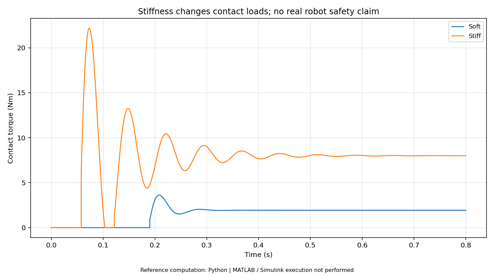

# 第09册｜伺服三环 · 机械共振 · 机器人关节

> 《电机控制：原理、案例与MATLAB实验》 · 版本1.0 · 2026-09-27  
> 原题范围：Q113, Q114, Q115, Q116, Q117, Q118, Q119, Q120, Q121, Q122, Q123, Q124, Q125, Q126, Q127, Q128  
> 本册对应实验：[L15 五次轨迹、位置速度级联与前馈](14_MATLAB实验逐步手册.md#lab15)；[L16 两惯量机械频响与陷波](14_MATLAB实验逐步手册.md#lab16)；[L17 关节阻抗与柔性接触](14_MATLAB实验逐步手册.md#lab17)

[返回总览](00_学习总览与环境指南.md) · [200题索引](99_200题分册与实验索引.md) · [实验手册](14_MATLAB实验逐步手册.md) · [验证边界](16_验证记录与已知边界.md)

**阅读方式：**先读下面连贯教程，再看原题逐项讲解与新增案例，最后按实验手册运行和改参数。正文所有数值模型为教学设定，不是你的电机实测参数。原题答案完整保留其主体内容，并补充新的案例与验证任务；不是只按标题切割原文件。

**执行边界：**本包的47张结果图来自独立Python参考实现。MATLAB主实验源码共24项，未在交付环境原生执行；扩展任务、PLL/HFI和动态弱磁等未完成项均明确标注。基础MATLAB实验不要求专业控制工具箱，Simulink入门模型另需Simulink。

## 一、三环不是“串三个 PID”这么简单

常见链路是位置误差产生速度参考，速度误差产生转矩或 iq 参考，电流误差产生电压。每一级输出都必须受到下一层能力限制，同时需要明确电机轴/输出轴单位、参考前馈、滤波与安全边界。[S11]

本册先把内层电流/转矩执行器简化为一阶环节，用来突出机械动态。L15 不重复运行 L11 的完整电气对象，因此不能用其轨迹结果证明某一真实电流环足够快；后续组合前必须重新检查时间尺度和执行器限制。

## 二、轨迹先平滑，控制器才有可实现的目标

直接给位置阶跃，数学上隐含无限速度/加速度要求。五次多项式可在有限时间内连接起点终点，并让两端速度、加速度为零。设归一时间 $s=(t-t_0)/T\in[0,1]$：

$$\theta_r=\theta_0+\Delta\theta(10s^3-15s^4+6s^5),$$
$$\omega_r=\frac{\Delta\theta}{T}(30s^2-60s^3+30s^4),$$
$$\alpha_r=\frac{\Delta\theta}{T^2}(60s-180s^2+120s^3).$$

L15 让位置在 0.3 s 内移动 1 rad，并比较反馈控制与速度/加速度前馈。速度前馈减少位置误差必须先积累才能产生速度的滞后，转矩前馈则用 $J\alpha_r+B\omega_r$ 预先补偿理想负载。

默认理想模型里，轨迹段 RMS 误差从约 0.337 rad 降到 0.000469 rad。这个巨大差别来自给定控制参数与理想已知对象，不应写成“加前馈普遍提高数百倍”。改变 J 或加入未知负载后，前馈不再完美，反馈仍不可缺少。

## 三、两惯量系统：柔性连接为什么限制带宽

电机与负载分别有惯量 $J_m,J_l$，中间由刚度 K、阻尼 C 连接：

$$J_m\ddot\theta_m=T_m-K(\theta_m-\theta_l)-C(\dot\theta_m-\dot\theta_l)-B_m\dot\theta_m,$$
$$J_l\ddot\theta_l=K(\theta_m-\theta_l)+C(\dot\theta_m-\dot\theta_l)-B_l\dot\theta_l-T_L.$$

忽略小阻尼时，柔性模态频率量级：

$$\omega_r\approx\sqrt{K(1/J_m+1/J_l)}.$$

L16 用频率域复数矩阵直接求频响，不依赖 Control System Toolbox 的 `tf/bode`。它画出机械共振峰，并叠加一个输入陷波滤波器。图中横轴是 $\log_{10}(f/Hz)$，纵轴是幅值 dB。

**输入滤波后的频响不是闭环稳定性证明。**陷波会改变相位，中心频率漂移也会削弱效果。真正整定时应包含控制器、采样延迟、传感器位置和限幅，再分析稳定裕量，而不是看到峰被压下就无限提高位置增益。

## 四、机器人力矩：电磁转矩不等于接触力

由 iq 推得的是电机电磁转矩；经过齿轮效率、摩擦、背隙、弹性、重力和惯性之后，输出端转矩才影响接触。双编码器可分别服务换相与输出位置，但输出端力矩仍需模型或传感器辅助。把两个编码器角度简单相减前，必须先换到同一轴侧并考虑减速比和零点。[S12]

阻抗控制的一个关节表达式为：

$$T^*=K_p(\theta_r-\theta)+D(\omega_r-\omega)+T_{ff}.$$

它让外部看到设定的弹簧与阻尼特性；导纳控制则把外力作为输入，经过虚拟质量—阻尼—刚度模型生成运动参考。两者选择取决于执行器、传感器和接触任务，不能只用“一个软，一个硬”概括。

## 五、L17：用碰墙场景看刚度的实际含义

虚拟目标位于 1 rad，墙在 0.6 rad。关节运动到墙后，继续接近目标会增加接触转矩。L17 比较 K=5 与 K=30 N·m/rad，保持阻尼等其他条件一致。高刚度通常压得更深或接触载荷更大，并不意味着任务完成得更安全。

本模型是理想力矩执行器加饱和与单自由度墙模型，没有人体、机械结构破坏、传感器故障、控制网络延迟和三维接触。图只能帮助理解刚度/接触关系，不能作为真实协作安全论证。

### 进阶作业

先固定 K 改 D，区分振荡与稳态压入量。再加入 1 ms、5 ms 转矩命令延迟，观察同样参数是否仍稳定。最后增加测量噪声，比较直接速度差分与滤波速度反馈。扩展项需要在脚本副本中实现；原始 L17 不包含这些延迟实验。

## 六、重力轴尤其要区分“失去转矩”和“安全停车”

对竖直负载，关闭功率并不会自动保持位置，机械能还可能驱动物体下落或回灌母线。运动规划、制动吸能、抱闸建立时间、故障检测与 STO 的关系要共同设计。先在 L18 与 L19 研究能量和状态顺序，再考虑实机，不应直接用碰墙示例控制真实机械臂。

## 本册代表结果预览

**图示解读：**虚拟刚度改变接触转矩，不提供真实机器人安全结论。 

> 此图为交付环境中实际执行的 **Python数值参考**。对应MATLAB源码已提供，但本次没有MATLAB/Simulink原生执行。

## 原题逐项精讲与新增案例

以下保留原题的参考回答、前提、追问与易错点；每题补充独立案例和可执行实验或纸面推演任务。原答案提到的附录A—E保存在[原题备份](../source/original_question_bank.md#appendix-a)中；本套新实验不依赖其中的C代码。

 | 题号 | 主题 |
|---|---|
| [Q113](#q113) | 位置、速度和转矩模式分别启用哪些环？ |
| [Q114](#q114) | 差分、测周期和混合测速低速时怎么取舍？ |
| [Q115](#q115) | 跟随误差、稳态误差、超调和整定时间怎样定义？ |
| [Q116](#q116) | 速度/加速度前馈与增加反馈增益有什么区别？ |
| [Q117](#q117) | 梯形速度与 S 曲线轨迹有什么区别？ |
| [Q118](#q118) | 两惯量、共振和反共振如何影响带宽？ |
| [Q119](#q119) | 陷波、低通和扰动观测器分别解决什么问题？ |
| [Q120](#q120) | 背隙、摩擦和弹性怎样影响定位？ |
| [Q121](#q121) | 电流估算转矩为什么不等于输出端实际转矩？ |
| [Q122](#q122) | 单编码器与双编码器分别能观测什么？ |
| [Q123](#q123) | 减速比如何影响速度、转矩、惯量和单位？ |
| [Q124](#q124) | 阻抗控制与导纳控制有什么区别？ |
| [Q125](#q125) | 刚度、阻尼和前馈转矩如何构成关节指令？ |
| [Q126](#q126) | 怎样做重力、摩擦和负载补偿？ |
| [Q127](#q127) | 延迟、速度噪声和机械弹性为什么影响接触稳定性？ |
| [Q128](#q128) | 单关节故障时整机怎样协调？ |

---

### Q113. 位置、速度和转矩模式分别启用哪些环？

**参考回答：**常见级联方案中，位置模式使用位置外环、速度中环和电流内环；速度模式绕过位置环；转矩模式把转矩参考变换为电流参考，主要依靠电流闭环实现。实际也存在不同结构，需以系统框图为准。

模式切换要处理参考连续性、积分状态和限值，防止旧位置误差在重新启用时突然输出很大转矩。即便转矩模式绕过速度调节，仍应保留适当的超速和行程保护。

**追问：**电流闭环就等于实际输出转矩闭环吗？不一定，摩擦、磁链、传动效率和弹性仍可能造成偏差。[S11]

#### 新增案例：把原理放进具体情境

位置模式需要完整外环链，转矩模式则主要给电流参考，但超速和机械边界仍要监督。关闭速度环不等于完全不读速度。

#### MATLAB验证 / 工程推演任务

在 L11/L15 对照各环输入输出，用表明确转矩、速度、位置模式哪些环参与正常调节、哪些量仅用于保护。

---

### Q114. 差分、测周期和混合测速低速时怎么取舍？

**参考回答：**固定时间计数法适合脉冲较多的速度区间，低速时计数可能只有 0 或 1，量化明显；测相邻边沿时间在低速更细，但无新边沿时速度会变旧，高速还受时间分辨率限制。

混合估计或观测器可利用两者信息，必须处理无边沿超时、方向反转和计数器回绕。滤波降低噪声的同时会增加相位延迟。

**工程落点：**报告最低可用速度、速度延迟、静止漂移和反转响应，不要只在中速展示平滑曲线。

#### 新增案例：把原理放进具体情境

低速下编码器每周期差分会出现量化台阶，测周期法则可能对快速变化反应慢。不同速度区可需要不同估计策略。

#### MATLAB验证 / 工程推演任务

运行 L10，比较 12/18 位与低通速度。记录滤波前噪声和滤波后延迟，不能只挑更平滑的曲线。

---

### Q115. 跟随误差、稳态误差、超调和整定时间怎样定义？

**参考回答：**跟随误差是参考轨迹与实际位置/速度的时变差；稳态误差是满足稳定工况后的残余差；超调需要说明相对最终目标还是阶跃幅度；整定时间需给出允许误差带及持续判定条件。

位置精度和重复定位精度也不同。测量单位要说明电机轴或输出轴，编码器读数未必覆盖传动背隙与末端变形。

**易错点：**只报告“误差 0.01°”，没有负载、速度、温度、测量位置和统计方法。

#### 新增案例：把原理放进具体情境

同样最终误差为零，快速大超调和缓慢单调接近的机械风险不同。报告位置精度不能只给一个最终点。

#### MATLAB验证 / 工程推演任务

用 L15 计算轨迹段 RMS、最大误差、负载突变后恢复时间，并写清采样窗口与目标轨迹，而非只写“误差很小”。

---

### Q116. 速度/加速度前馈与增加反馈增益有什么区别？

**参考回答：**前馈根据期望轨迹或模型提前提供执行量，减少需要由误差推动的反馈动作；提高反馈增益则是在误差已经出现后更强地校正。理想情况下，速度前馈改善轨迹跟随，加速度对应的惯性转矩前馈减小加减速误差。

前馈依赖模型与轨迹，不能消除未知扰动，也不能绕过限流/限压。过大的反馈增益可能放大噪声或激发机械共振。

**工程落点：**先建立稳定反馈，再逐项加前馈，比较同轨迹误差和峰值电流，而不是把前馈当成重新调高增益。[S11]

#### 新增案例：把原理放进具体情境

前馈使用已知 Jα+Bω 提前给转矩，能减少误差后才反馈的滞后；参数错误时前馈也会出错，所以反馈仍要保留。

#### MATLAB验证 / 工程推演任务

运行 L15，再只把真实 J 加倍但保持前馈参数不变，比较收益变化。这是需要另存实现的失配实验，默认图是理想匹配结果。

---

### Q117. 梯形速度与 S 曲线轨迹有什么区别？

**参考回答：**梯形速度限制速度和加速度，但加速度在分段交界处可能突变；S 曲线进一步限制加加速度 jerk，使加速度变化更平滑，有助于降低激励高频机械模态的程度。

代价可能是相同距离和约束下的运动时间变化，且短距离轨迹不一定出现完整匀速段。实时改目标还要保证位置、速度和必要的加速度连续。

**追问：**轨迹足够平滑就不需要闭环吗？仍需要反馈处理负载、模型误差、摩擦和扰动。

#### 新增案例：把原理放进具体情境

0.3 s 移动 1 rad 的五次轨迹两端速度和加速度为零，但并不代表所有时刻的 jerk 都按某真实机构限制设计。运动规划需独立验算峰值。

#### MATLAB验证 / 工程推演任务

由本册多项式求速度、加速度和 jerk，画三条独立曲线；把时间减半，预测速度翻倍、加速度变四倍。

---

### Q118. 两惯量、共振和反共振如何影响带宽？

**参考回答：**电机与负载通过有限刚度联轴器、皮带或减速机构连接，可以近似为两个惯量加弹性/阻尼。系统频率响应会出现共振与反共振，电机端运动不再总等于负载端运动。

若速度/位置环跨越这些模态时没有足够相位裕量，增益提高可能导致振荡。可通过机械改进、传感器位置选择、滤波和控制结构处理。

**工程落点：**先测频率响应与模态随负载变化的范围，再决定带宽；不能仅靠“噪声一响就把 P 调小”完成整定。

#### 新增案例：把原理放进具体情境

电机端与负载端之间有弹性，电机角度平滑不保证负载不振。共振与反共振取决于测量端和两侧惯量，不能只看单惯量模型。

#### MATLAB验证 / 工程推演任务

运行 L16，改变 K 为原来的四倍，预测理想共振频率约翻倍；说明阻尼与测量位置还会改变峰值。

---

### Q119. 陷波、低通和扰动观测器分别解决什么问题？

**参考回答：**陷波在特定频段衰减，可抑制已识别的机械共振；低通广泛衰减高频噪声，也会带来延迟；扰动观测器用模型和测量估计等效扰动，再实施补偿。

任何一种都可能因模型/频率变化、延迟和非最小相位特性而受到限制。陷波中心与实际模态偏离可能效果变差；扰动估计过快可能放大测量噪声。

**易错点：**叠很多滤波器让波形好看，却不检查总相位和真实跟随性能。

#### 新增案例：把原理放进具体情境

陷波压低某频率输入，却同时改变相位；负载变化让机械共振移动时，固定陷波可能不再有效。图上峰值下降不是闭环裕量证明。

#### MATLAB验证 / 工程推演任务

在 L16 改负载惯量，保持陷波频率不变，比较错位；闭环稳定性分析列为后续独立实验。

---

### Q120. 背隙、摩擦和弹性怎样影响定位？

**参考回答：**背隙在换向时形成输入位移不能立即传到输出的区间；静摩擦会造成起动门槛和小幅黏滑；库仑摩擦与速度符号有关；弹性使负载随转矩产生形变并引入模态。

提高积分可以积累足够力克服摩擦，却可能形成低速爬行或极限环。补偿需要实验和物理边界，双编码器、机械预紧及更好传动设计有时比增加算法更直接。

**工程落点：**分别做双向定位、低速匀速、负载阶跃和不同温度实验，避免只在单向空载行程上宣称精度达标。

#### 新增案例：把原理放进具体情境

静摩擦会让小指令不动，背隙会让换向出现空程，弹性则产生负载相关偏差。三者不能用同一个低通滤波器消除。

#### MATLAB验证 / 工程推演任务

为三种非理想分别画输入输出概念曲线，再在 L15 的副本中一次只加入一种，观察误差特征。

---

### Q121. 电流估算转矩为什么不等于输出端实际转矩？

**参考回答：**电流经电机模型得到的是电磁转矩估计，实际电机轴转矩还受惯量加速、摩擦和损耗影响；再经过减速器，又受到传动效率、静摩擦、弹性、背隙和输出端惯量影响。

静止接触时，单一效率常数甚至不足以表达摩擦方向与负载传递。需要高质量输出力矩时，可加入输出端力矩传感器、弹性元件测量或经过验证的动力学估计。

**易错点：**简单使用 `输出力矩 = Iq × Kt × 减速比`，就宣称达到高精度输出力矩闭环。该式只能作为明确假设下的近似。

#### 新增案例：把原理放进具体情境

iq=4 A 对应 .48 N·m 电磁转矩，经过减速器后的输出还要扣除摩擦和动态惯性。用于接触力估计时，静止与运动工况的误差可能不同。

#### MATLAB验证 / 工程推演任务

建立从电流到电磁转矩、齿轮输出转矩、接触力的单位链，列每一步需要的参数及未知量。

---

### Q122. 单编码器与双编码器分别能观测什么？

**参考回答：**电机端编码器适合换相和高速局部反馈，但无法直接看见减速器之后的背隙与弹性误差；输出端编码器观察机构实际位置，但单独用于换相可能受分辨率、传动误差、弹性和延迟影响。

双编码器可让电机端负责换相/内环、输出端负责位置或形变观测，但两者的时间对齐、单位转换和稳定性要单独设计。不能把两个位置值直接平均当作更准确的反馈。

**工程落点：**定义两路角度到同一物理坐标的映射和差值意义，再判断差值是背隙、弹性、滑动还是传感器异常。[S12]

#### 新增案例：把原理放进具体情境

电机端编码器适合换相，输出端编码器能看到减速器后的位置误差；只用输出端做电角度可能不满足分辨率和延迟要求。

#### MATLAB验证 / 工程推演任务

把两编码器转换到同一轴侧后计算扭转差，再列背隙、零点和同步误差对这一量的影响。

---

### Q123. 减速比如何影响速度、转矩、惯量和单位？

**参考回答：**定义 $N=\omega_m/\omega_o$，刚性理想关系下 $\theta_m=N\theta_o$、$\omega_m=N\omega_o$，负载惯量反射为 $J_L/N^2$。电动方向输出转矩可近似 $T_o=\eta NT_m$。

控制器必须说明反馈和参考使用电机轴还是输出轴单位；速度 PI 若把输出端速度当成电机端速度，增益和限值都会错。减速比也不能直接把编码器绝对精度提高 N 倍，因为还存在传动误差。

**追问：**输出端高刚度控制是否会与电机端速度环冲突？需要考虑两惯量动态和环路带宽分配。

#### 新增案例：把原理放进具体情境

减速比 N=10，负载惯量反射为 JL/100，电机速度为输出的十倍；转矩乘 N 还受效率与方向影响。不能只享受转矩放大而忽略速度。

#### MATLAB验证 / 工程推演任务

用本册案例改变 N，分别画电机所需速度、稳态转矩与反射惯量，找出机械限速和控制量程边界。

---

### Q124. 阻抗控制与导纳控制有什么区别？

**参考回答：**阻抗控制规定运动误差对应怎样的力/转矩响应，常以位置和速度测量生成转矩指令；导纳控制根据测得的力/转矩求运动响应，再给位置/速度执行器。二者分别类似实现“机械阻抗”和它的逆关系。

选择依赖执行器可控变量、是否易回驱、力传感、接触刚度和延迟。名称相近不表示代码只是正负号或输入输出对调，离散实现与稳定性约束不同。

**工程落点：**用已知弹性/阻尼环境验证接触稳定性，不能只在自由空间看动作平滑就认定可以安全接触。

#### 新增案例：把原理放进具体情境

阻抗控制让运动误差形成力矩，导纳控制则由外力形成运动参考。力矩可控性弱或力传感缺失时，二者实现条件很不同。

#### MATLAB验证 / 工程推演任务

阅读 L17 指令式，标出它为何是阻抗示例；另写导纳的质量—阻尼—刚度方程，不把两条接口混用。

---

### Q125. 刚度、阻尼和前馈转矩如何构成关节指令？

**参考回答：**一种常见的简化关节律是：

$$
\tau_{cmd}=K_p(q_{ref}-q)+K_d(\dot q_{ref}-\dot q)+\tau_{ff}
$$

其中 Kp 对应角刚度意义、Kd 对应阻尼意义，但这是控制律而不是证明系统已经等效为理想弹簧阻尼。电流环动态、传动、采样和饱和都会改变实际行为。

指令还应经过转矩、速度、功率、温度与变化率等限制；前馈不能绕过安全限制。位置与速度单位必须一致，尤其注意 rad 与圈、deg 的换算。

**易错点：**照抄另一个电机的 Kp/Kd 数值，却没有核对转矩单位、减速比和执行频率。

#### 新增案例：把原理放进具体情境

目标在墙后时，位置误差持续存在，Kp 增大使接触力矩增加，不一定让真实位置更接近而又更安全。Kd 则主要影响动态阻尼。

#### MATLAB验证 / 工程推演任务

运行 L17 比较两种刚度，分别看位置与接触力矩；固定 K 只改 D，区分稳态压入和暂态振荡。

---

### Q126. 怎样做重力、摩擦和负载补偿？

**参考回答：**重力补偿来自机构几何、质量分布和姿态；摩擦可从双向低速与不同载荷实验拟合；负载变化可通过力传感、动力学残差或参数估计处理。先确保基本反馈稳定，再逐项加入补偿。

补偿应有范围、平滑性和失效退化，尤其在速度过零时，直接使用不连续符号摩擦项可能引入抖动。质量模型不准确时也可能在某些姿态过补偿。

**工程落点：**用未参与拟合的姿态、温度和负载测试，检查跟随、静止保持、电流与接触行为是否真正改善。

#### 新增案例：把原理放进具体情境

竖直关节静止仍需要重力转矩；仅靠位置积分补偿会先产生偏差，模型前馈能减小但不能消除所有参数误差。

#### MATLAB验证 / 工程推演任务

在 L17 副本加入角度相关重力项，并比较有/无补偿。当前基础脚本没有多连杆重力模型，需明确是单自由度扩展。

---

### Q127. 延迟、速度噪声和机械弹性为什么影响接触稳定性？

**参考回答：**接触环境可能非常刚，短时间位置误差就产生较大作用力；反馈延迟导致施加的阻尼/刚度转矩相对真实运动滞后，可能不再耗能而反向注入能量。速度噪声经阻尼增益放大，机械弹性又带来额外模态。

因此不能只提高位置刚度追求“更稳”。应结合内环带宽、滤波、采样、环境刚度、转矩限制和必要的被动性/能量约束分析。

**追问：**PC 上 1 kHz 发命令，是否等于关节有 1 kHz 接触控制带宽？不等于，还要看通信、执行器和整个闭环延迟。

#### 新增案例：把原理放进具体情境

接触控制中几毫秒延迟可能改变阻尼效果，带噪速度差分也会把噪声放大为转矩。理想零延迟图不能证明真实机器人接触稳定。

#### MATLAB验证 / 工程推演任务

在 L17 增加命令延迟队列和速度噪声，逐步扫描边界；所有碰墙测试先在仿真中进行，不直接驱动实机。

---

### Q128. 单关节故障时整机怎样协调？

**参考回答：**先判断故障关节失去的是传感、通信、可控转矩还是供电，再评估整机姿态、重力负载和相邻关节约束。可能需要受控停车、支撑转移、抱闸或停止其他轴，不能让上层继续使用过期关节状态规划。

故障消息应包含时间戳、原因和实际输出状态；整机与关节要有一致的失联与恢复协议。恢复时重新建立位置可信度与运动许可。

**工程落点：**对每种单点故障写出“谁检测、谁决策、谁执行、多久完成、怎么确认”，再做受控验证。

#### 新增案例：把原理放进具体情境

一个支撑关节掉电时，其他轴继续原轨迹可能恶化姿态。单轴 FAULT 状态需要上升到整机协调，但不意味着所有轴必须采用同一种停车动作。

#### MATLAB验证 / 工程推演任务

为一个双关节静态支撑场景写故障传播、降级命令和能量去向，说明哪些信号必须独立于正常控制通信。

---

## 本册完成检查

能否在不看答案时解释本册核心因果链？能否先预测改参数后曲线往哪个方向变化？能否指出模型省略的物理因素？把实际结果、失败条件和剩余问题填写到[实验报告模板](../templates/01_实验报告模板.md)。原理理解、MATLAB运行、目标MCU和实机验证是不同完成状态，不合并打勾。

## 引用与进一步阅读

方括号S编号沿用原题官方资料；N编号是本次新增的官方软件接口资料。详见[资料与符号](15_参考资料与符号约定.md)。具体公式、教学案例与实验代码为本教程组织和推导，模型结果只适用于所列条件。

[S01]: https://www.mathworks.com/help/mcb/vector-control-foc-and-dtc.html
[S02]: https://www.mathworks.com/help/mcb/gs/obtain-controller-gains-foc-example.html
[S03]: https://www.mathworks.com/help/mcb/ref/mtpacontrolreference.html
[S04]: https://www.mathworks.com/help/mcb/ref/pwmreferencegenerator.html
[S05]: https://www.mathworks.com/help/mcb/ug/prepare-task-scheduling.html
[S06]: https://www.mathworks.com/help/mcb/sensor-calibration.html
[S07]: https://www.mathworks.com/help/mcb/sensorless-approach.html
[S08]: https://www.mathworks.com/help/mcb/motor-parameter-estimation-and-plant-modelling.html
[S09]: https://www.mathworks.com/help/mcb/deployment-and-validation.html
[S10]: https://wiki.st.com/stm32mcu/wiki/STM32MotorControl:Introduction_to_Motor_Control_with_STM32
[S11]: https://docs.odriverobotics.com/v/latest/manual/control.html
[S12]: https://docs.odriverobotics.com/v/latest/manual/hardware-config.html
[S13]: https://www.can-cia.org/can-knowledge/cia-402-series-canopen-device-profile-for-drives-and-motion-control
[S14]: https://www.analog.com/en/resources/analog-dialogue/articles/mastering-precision-understanding-microstepping.html
[S15]: https://www.ti.com/lit/SLYT762
[S16]: https://www.ti.com/lit/an/slva959b/slva959b.pdf
[S17]: https://www.mathworks.com/help/mcb/ref/surfacemountpmsm.html
[S18]: https://www.mathworks.com/help/mcb/ref/parktransform.html
[S19]: https://www.mathworks.com/help/mcb/ref/clarketransform.html
[S20]: https://www.mathworks.com/help/mcb/ref/fieldorientedcurrentcontroller.html
[S21]: https://www.mathworks.com/help/mcb/gs/field-weakening-control.html
[S22]: https://www.can-cia.org/can-knowledge/can-fd-the-basic-idea
[S23]: https://www.mathworks.com/help/mcb/ref/slidingmodeobserver.html
[S24]: https://www.mathworks.com/help/mcb/ref/fluxobserver.html
[S25]: https://www.mathworks.com/help/mcb/ref/extendedemfobserver.html
[S26]: https://www.mathworks.com/help/mcb/ref/pulsatinghighfreqobserver.html
[S27]: https://search.abb.com/library/Download.aspx?Action=Launch&DocumentID=3AXD50000035169&DocumentPartId=&LanguageCode=en
[S28]: https://www.beckhoff.com/en-en/products/i-o/ethercat-terminals/el-ed6xxx-communication/el6692.html
[N01]: https://www.mathworks.com/help/simulink/ug/integrate-ccode-ccaller.html
[N02]: https://www.mathworks.com/matlabcentral/fileexchange/183591-simulink-support-package-for-rust-code
[N03]: https://www.mathworks.com/help/simulink/slref/add_block.html
[N04]: https://www.mathworks.com/help/simulink/slref/sim.html
