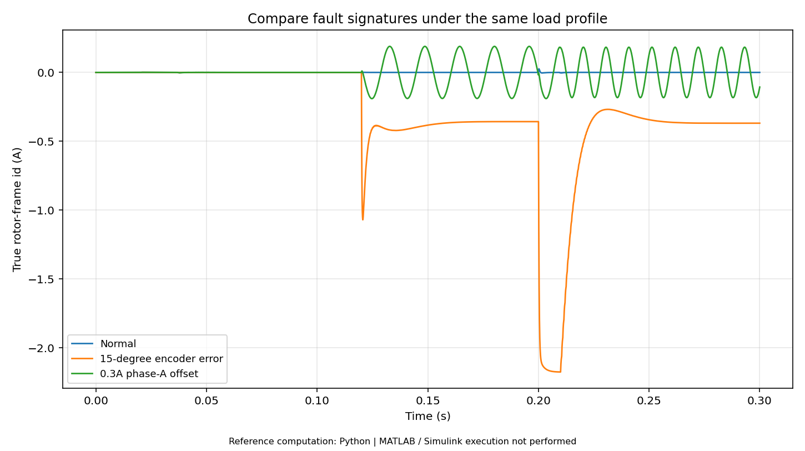

# 第13册｜项目案例 · 面试表达 · 实验报告

> 《电机控制：原理、案例与MATLAB实验》 · 版本1.0 · 2026-09-27  
> 原题范围：Q191, Q192, Q193, Q194, Q195, Q196, Q197, Q198, Q199, Q200  
> 本册对应实验：[L11 完整有感平均值FOC与故障注入](14_MATLAB实验逐步手册.md#lab11)；[L18 母线回灌与制动电阻](14_MATLAB实验逐步手册.md#lab18)；[L20 R/L参数辨识与残差](14_MATLAB实验逐步手册.md#lab20)

[返回总览](00_学习总览与环境指南.md) · [200题索引](99_200题分册与实验索引.md) · [实验手册](14_MATLAB实验逐步手册.md) · [验证边界](16_验证记录与已知边界.md)

**阅读方式：**先读下面连贯教程，再看原题逐项讲解与新增案例，最后按实验手册运行和改参数。正文所有数值模型为教学设定，不是你的电机实测参数。原题答案完整保留其主体内容，并补充新的案例与验证任务；不是只按标题切割原文件。

**执行边界：**本包的47张结果图来自独立Python参考实现。MATLAB主实验源码共24项，未在交付环境原生执行；扩展任务、PLL/HFI和动态弱磁等未完成项均明确标注。基础MATLAB实验不要求专业控制工具箱，Simulink入门模型另需Simulink。

## 一、用三条项目主线，把知识变成证据

面试题可以按编号背，但工程能力必须通过因果和证据连接。建议将本课程组织成三个逐步完成的个人学习项目，而不把所有实验都写成“量产驱动器项目”。

| 主线 | 交付证据 | 当前边界 |
|---|---|---|
| A：有感 PMSM 控制 | 模型约定、L04/L05 自检、L07/L08 控制对照、L11 全链路与故障图 | 纯软件平均值模型，无实机 |
| B：驱动保护与能源 | L18 能量账、L19 迁移与锁存、故障记录模板 | 教学状态机与理想制动模型，非认证方案 |
| C：参数辨识与部署准备 | L20 参数/残差、L21 预算、L22 数值误差 | 合成数据与预算，不是 MCU 性能报告 |

完成后可以诚实表达“实现并验证了这些仿真模块，理解相应约束，下一步尚需哪些硬件验证”。不要将合成数据写成测功机实测，也不要把官方 SDK 的模块全部写成自己发明。

## 二、案例 A：为什么速度正常仍需要看电流

L11 正常和偏角模式都可能恢复目标速度。若只以速度误差作为成功标准，就会漏掉真实 d 电流偏移。对真实 SPMSM，额外无效电流可能增加铜耗并减少可用转矩裕量。比较时应同时报告速度误差、真实 id/iq、电压利用率和限制触发。

一份好的实验记录会写：对象参数、控制周期、增益、注入时刻、角度定义、观测量、对照组和限制。结论应是“在本模型下，错误角度闭环可掩盖在速度指标背后，但改变真实 dq 电流分配”，而不是“所有电机发热都是编码器偏角”。

## 三、案例 B：先算能量再讨论保护阈值

L18 从 9 J 动能推导电容母线可能升到约 102.4 V，说明无吸能路径时，仅提高过压阈值不解决物理问题。有电阻组约 52.06 V 是给定电阻、滞回与时间步长下的结果，选型报告还缺脉冲能量、重复温升、制动管和故障链。

面试里可以用这一例说明如何从现象“急停过压”逐步进入模型、计算、候选方案和测试。但必须标为仿真实验，不能声称做过真实电机急停或通过硬件认证。

## 四、案例 C：参数估得很准，也可能只是在拟合自己

L20 用已知模型生成输入输出，之后能恢复接近真实 R/L；这很适合检查推导与程序。它不能证明面对实际逆变器死区、电压偏差、饱和和电流噪声仍有同样误差。真正的进阶是冻结辨识参数、换一个工况验证，再加入模型不匹配，观察残差结构。

报告不仅写最小二乘结果，还应写数据长度、激励、Ts、传感器误差假设、Φ 条件数、拟合与验证是否分离，以及参数范围检查。错误地得到负电感时，应拒绝结果并分析原因，而不是静默取绝对值。

## 五、回答项目问题的五层结构

**需求：**需要什么速度、转矩、精度、时延与安全边界。**方案：**为什么选这套电机、传感器和控制结构。**实现：**状态、采样、运算和输出怎样对应。**证据：**用什么模型/仪器、在什么工况测得什么。**局限：**哪些条件没有验证、模型省略了什么、接下来如何补齐。

例如回答“为什么电流环采用 20 kHz”，不能只说“大家都这么用”。你需要解释电机电感、纹波、目标带宽、ADC 有效窗口、开关损耗、MCU 截止期等取舍，然后说明在本教程它只是统一假设，真实硬件还要测量。

## 六、把每次实验变成可复现记录

模板目录提供实验报告、参数台账、故障复盘和实机准入检查。最小记录应包含原始参数、脚本版本/哈希、运行环境、输入工况、结果文件、指标定义和结论边界。没有改代码版本记录的“之前比现在差”很难复现。

建议每册结束做一次不看资料的复述：先画信号链，再写关键方程，最后解释一个反例。比如“PI 消除静差”的反例是执行器长期饱和；“三相和为零”的反例是通路或时间不满足；“编码器位数高”的反例是精度与延迟仍不合格。

## 七、完整能力路线，而不是必须一次做完全部

第一阶段把基础和有感平均值闭环跑通；第二阶段加入采样、延迟、量化和保护；第三阶段选择无感、弱磁或机器人伺服专项；第四阶段再进入仿真与真实控制代码互通。三维机械接触、高压逆变器寄生、完整 HFI/PLL 无感启动和通信协议栈都不属于已经交付并验证的功能。

你可以据此逐步形成自己的电机控制实验库：每新增一个功能都带一个对照实验、一个失败边界和一个回归测试，而不是只把代码越堆越多。

## 本册代表结果预览

**图示解读：**相同闭环中两类故障的真实d电流特征。 

> 此图为交付环境中实际执行的 **Python数值参考**。对应MATLAB源码已提供，但本次没有MATLAB/Simulink原生执行。

## 原题逐项精讲与新增案例

以下保留原题的参考回答、前提、追问与易错点；每题补充独立案例和可执行实验或纸面推演任务。原答案提到的附录A—E保存在[原题备份](../source/original_question_bank.md#appendix-a)中；本套新实验不依赖其中的C代码。

 | 题号 | 主题 |
|---|---|
| [Q191](#q191) | 为什么选择这类电机和控制方案？替代方案是什么？ |
| [Q192](#q192) | 电机关键参数是多少？来自哪里？ |
| [Q193](#q193) | 控制框图、硬件框图、软件任务图怎样对应？ |
| [Q194](#q194) | 各环频率是多少？为什么这样选？ |
| [Q195](#q195) | 最坏执行时间是多少？怎么测？ |
| [Q196](#q196) | 你亲自做了什么？哪些来自 SDK 或开源项目？ |
| [Q197](#q197) | 最难故障是什么？怎样证明根因？ |
| [Q198](#q198) | 改进前后有什么可量化差异？ |
| [Q199](#q199) | 做过哪些长期、异常和故障恢复测试？ |
| [Q200](#q200) | 重新设计一版，你会保留和修改什么？ |

---

### Q191. 为什么选择这类电机和控制方案？替代方案是什么？

**回答结构：**先交代负载、速度/转矩、响应、精度、成本和供电约束；再比较候选电机与驱动；最后说明选择理由及放弃的能力。例如“为了低速力矩与受控接触，选择带位置反馈的电流闭环”，比“FOC 更先进”更有说服力。

**必须准备：**至少一个真实替代方案，说明它在哪些方面更简单或成本更低，以及为什么未采用。不要把自己的选择描述成所有场景的唯一答案。

**追问：**需求改变为低成本风机后是否还这么选？用需求变化说明架构取舍，而不是坚持原方案。

#### 新增案例：把原理放进具体情境

“因为SDK有例程所以采用FOC”可以解释实现便利，但不够解释方案适配。还需对照噪声、动态、效率、传感器和成本需求。

#### MATLAB验证 / 工程推演任务

用项目A写一页需求—候选—取舍表，只填写真实学习项目背景，不编客户或量产经历。

---

### Q192. 电机关键参数是多少？来自哪里？

**回答结构：**准备一张带单位的参数表：极对数、每相 Rs、Ld/Lq、磁链/Kt、母线范围、连续/峰值电流、机械转速、编码器 CPR、负载惯量。每个值写来源与温度/工作点。

**必须区分：**厂家值、实测值、辨识值、暂定假设。若只知道线间电阻或相电流 RMS，应说明怎样转换成算法参数。

**追问：**哪个参数最不可信？回答误差来源和对控制的影响，并拿出复核方式，而不是把所有值都称为精确值。

#### 新增案例：把原理放进具体情境

本教程R/L/ψ等是教学假设，不是你的电机实测。面试里引用它们时应明确模拟对象，不把4对极和8A说成真实硬件参数。

#### MATLAB验证 / 工程推演任务

填参数台账的来源列，区分假设、厂家、辨识、实测与推导；未知项保留待确认。

---

### Q193. 控制框图、硬件框图、软件任务图怎样对应？

**回答结构：**控制图说明物理信号和闭环；硬件图说明采样、功率、传感和保护；任务图说明执行上下文、频率、数据所有权和时序。三图之间应该能从一个相电流样本一路追到实际 PWM。

**必须准备：**标出保护独立链路、采样与角度时间戳、命令入口和记录出口。说清哪些信号为真实测量，哪些为重构/估计。

**追问：**通信线程怎样改变电流参考而不造成半更新？说明快照、双缓冲或其他一致性机制。

#### 新增案例：把原理放进具体情境

算法框图说明控制关系，硬件框图说明采样/驱动资源，任务图说明何时执行。只有其中一张不能证明完整实现。

#### MATLAB验证 / 工程推演任务

以L11为算法图，以L21为时间预算，另画目标MCU资源草图并标未验证；三张图用同一信号命名。

---

### Q194. 各环频率是多少？为什么这样选？

**回答结构：**列 PWM、采样、电流环、速度环、位置环、通信、温度与日志频率，说明它们是否同频或分频。依据包括电频率、采样窗、开关损耗、机械动态和 MCU 预算。

**必须区分：**设计频率、实测频率和闭环带宽；日志频率低于控制频率时，不能用低速日志证明高频没有纹波。

**追问：**将 PWM 翻倍会怎样？同时分析损耗、采样时间、分辨率和计算余量，不能只说响应更快。

#### 新增案例：把原理放进具体情境

20kHz电流、2kHz速度只是本包配置，不是所有驱动器最佳频率。采样窗、机械带宽、开关损耗与算力都参与取舍。

#### MATLAB验证 / 工程推演任务

把各周期、数据年龄和带宽分别列出，说明改周期时哪些积分/滤波系数需要重算。

---

### Q195. 最坏执行时间是多少？怎么测？

**回答结构：**说明使用周期计数器、GPIO 或分析工具，测试过哪些分支、缓存状态、通信负荷和多轴组合，并给出测得最大值、截止期和剩余裕量。

**诚实边界：**未做严格 WCET 分析时，称“已覆盖场景下测得的最大执行时间”，不要称已证明的绝对上界。解释你怎样检测运行时超期。

**追问：**优化前后提升从哪里来？给调用热点、编译配置和数值误差验证，而不是只报总体百分比。

#### 新增案例：把原理放进具体情境

Python参考脚本跑得快不能证明MCU满足50μs截止期，MATLAB执行时间同样不是嵌入式WCET。

#### MATLAB验证 / 工程推演任务

在项目报告中把桌面数值运行与目标性能两栏分开；只有完成目标板测量后填写目标执行时间。

---

### Q196. 你亲自做了什么？哪些来自 SDK 或开源项目？

**回答结构：**按算法、硬件、外设、上位机、调试和测试列真实负责范围。使用 SDK 可以直接说明，再解释修改点、接口、参数依据和验证成果。

**有价值的表达：**“SDK 提供电流控制核心，我完成采样拓扑适配、编码器校准、故障管理和实测整定”，比把整个 SDK 宣称为从零自研可信。

**追问：**换一个 MCU 需要改哪些层？能明确区分纯数学、调度、外设和硬件保护的人，通常更容易讲清工程结构。

#### 新增案例：把原理放进具体情境

调用官方库、改参数、写驱动和独立设计算法是不同贡献。准确说明使用了哪些组件，比笼统说“全部自主开发”更可信。

#### MATLAB验证 / 工程推演任务

为每个模块填写来源、自己修改、验证方式与许可证注意项；本包代码与原始题库也分别标来源。

---

### Q197. 最难故障是什么？怎样证明根因？

**回答结构：**按“现象—环境—候选原因—测量—排除—根因—修复—回归”叙述。讲明为什么其他候选被排除，而不是“换了某器件就好了”。

**必须准备：**至少一张关键波形、一段时序或一次可重复实验。若根因仍只是高概率判断，就明确证据和不确定性。

**追问：**为何原测试没发现？解释覆盖缺口和之后增加的防回归测试，体现系统改善而不只是个人救火。

#### 新增案例：把原理放进具体情境

一次偏角故障复盘应展示原始现象、竞争假设、判别数据、修改与回归，而不只是最终把offset改对。

#### MATLAB验证 / 工程推演任务

使用模板复盘L11角度注入，明确它是人为仿真故障；不要将故障故事描述成真实烧板经历。

---

### Q198. 改进前后有什么可量化差异？

**回答结构：**固定供电、负载、温度、速度、测量带宽与算法版本，比较目标指标，例如电流阶跃、跟随误差、CPU 时间、峰值电流、效率或启动成功率。

**必须避免：**一边改控制算法，一边换更大电机/更高母线，却把全部收益归给算法。要有单变量实验或明确承认因素耦合。

**追问：**改进有没有代价？同时报告噪声、算力、参数敏感性、热和维护复杂度，不能只展示有利指标。

#### 新增案例：把原理放进具体情境

L15前馈在理想匹配对象下收益明显，但比较必须保持同一轨迹、负载、限制与采样。更换多个条件后不能把改善全归功于一个算法。

#### MATLAB验证 / 工程推演任务

分别记录基线与修改组参数差异、指标窗口和结果文件，提出至少一个可能削弱收益的反例。

---

### Q199. 做过哪些长期、异常和故障恢复测试？

**回答结构：**列测试时长、样机数、环境范围、负载循环、异常注入和恢复条件，并区分仿真、HIL 与实机验证。失败项和未覆盖项也要明确。

**必须准备：**温升曲线、错误计数、故障先后时间、参数版本和重启后的安全状态。只说“跑了一晚上没事”缺少可判断的测试条件。

**追问：**未发生故障是否证明可靠？只能支持已覆盖条件下的观察，需要结合风险、样本量和针对性试验判断。

#### 新增案例：把原理放进具体情境

24个参考实验通过，不等于完整电机驱动验收。它们没有覆盖真实传感器、EMC、器件温升和机械失效。

#### MATLAB验证 / 工程推演任务

按验证说明列已执行、待本机MATLAB、待目标MCU、待实机四类，禁止把计划状态标为通过。

---

### Q200. 重新设计一版，你会保留和修改什么？

**回答结构：**从已验证问题出发，分别给结构、硬件、算法和测试改进。每项写收益、代价和如何验收，例如“增加独立故障锁存解决复位前日志丢失”，而不是只说换更快芯片。

**建议表达：**先保留已经有证据可靠的部分，再解决最影响产品目标的瓶颈；新算法或新器件应以可测指标验证价值。

**最后自问：**是否能完整解释“一次 FOC 周期发生了什么”和“一次故障如何被证实并防止再次出现”？这两条贯通之后，题库里的知识才能成为可展示的工程能力。

#### 新增案例：把原理放进具体情境

重新设计时应优先解决已经证实的问题，例如单位散乱、时间戳缺失、测试不可复现；增加一个复杂观测器未必是最有效改进。

#### MATLAB验证 / 工程推演任务

从自己的实验记录选三个具体缺陷，写改动、风险、验收标准和回归范围，而不是只有“架构优化”四个字。

---

## 本册完成检查

能否在不看答案时解释本册核心因果链？能否先预测改参数后曲线往哪个方向变化？能否指出模型省略的物理因素？把实际结果、失败条件和剩余问题填写到[实验报告模板](../templates/01_实验报告模板.md)。原理理解、MATLAB运行、目标MCU和实机验证是不同完成状态，不合并打勾。

## 引用与进一步阅读

方括号S编号沿用原题官方资料；N编号是本次新增的官方软件接口资料。详见[资料与符号](15_参考资料与符号约定.md)。具体公式、教学案例与实验代码为本教程组织和推导，模型结果只适用于所列条件。

[S01]: https://www.mathworks.com/help/mcb/vector-control-foc-and-dtc.html
[S02]: https://www.mathworks.com/help/mcb/gs/obtain-controller-gains-foc-example.html
[S03]: https://www.mathworks.com/help/mcb/ref/mtpacontrolreference.html
[S04]: https://www.mathworks.com/help/mcb/ref/pwmreferencegenerator.html
[S05]: https://www.mathworks.com/help/mcb/ug/prepare-task-scheduling.html
[S06]: https://www.mathworks.com/help/mcb/sensor-calibration.html
[S07]: https://www.mathworks.com/help/mcb/sensorless-approach.html
[S08]: https://www.mathworks.com/help/mcb/motor-parameter-estimation-and-plant-modelling.html
[S09]: https://www.mathworks.com/help/mcb/deployment-and-validation.html
[S10]: https://wiki.st.com/stm32mcu/wiki/STM32MotorControl:Introduction_to_Motor_Control_with_STM32
[S11]: https://docs.odriverobotics.com/v/latest/manual/control.html
[S12]: https://docs.odriverobotics.com/v/latest/manual/hardware-config.html
[S13]: https://www.can-cia.org/can-knowledge/cia-402-series-canopen-device-profile-for-drives-and-motion-control
[S14]: https://www.analog.com/en/resources/analog-dialogue/articles/mastering-precision-understanding-microstepping.html
[S15]: https://www.ti.com/lit/SLYT762
[S16]: https://www.ti.com/lit/an/slva959b/slva959b.pdf
[S17]: https://www.mathworks.com/help/mcb/ref/surfacemountpmsm.html
[S18]: https://www.mathworks.com/help/mcb/ref/parktransform.html
[S19]: https://www.mathworks.com/help/mcb/ref/clarketransform.html
[S20]: https://www.mathworks.com/help/mcb/ref/fieldorientedcurrentcontroller.html
[S21]: https://www.mathworks.com/help/mcb/gs/field-weakening-control.html
[S22]: https://www.can-cia.org/can-knowledge/can-fd-the-basic-idea
[S23]: https://www.mathworks.com/help/mcb/ref/slidingmodeobserver.html
[S24]: https://www.mathworks.com/help/mcb/ref/fluxobserver.html
[S25]: https://www.mathworks.com/help/mcb/ref/extendedemfobserver.html
[S26]: https://www.mathworks.com/help/mcb/ref/pulsatinghighfreqobserver.html
[S27]: https://search.abb.com/library/Download.aspx?Action=Launch&DocumentID=3AXD50000035169&DocumentPartId=&LanguageCode=en
[S28]: https://www.beckhoff.com/en-en/products/i-o/ethercat-terminals/el-ed6xxx-communication/el6692.html
[N01]: https://www.mathworks.com/help/simulink/ug/integrate-ccode-ccaller.html
[N02]: https://www.mathworks.com/matlabcentral/fileexchange/183591-simulink-support-package-for-rust-code
[N03]: https://www.mathworks.com/help/simulink/slref/add_block.html
[N04]: https://www.mathworks.com/help/simulink/slref/sim.html
